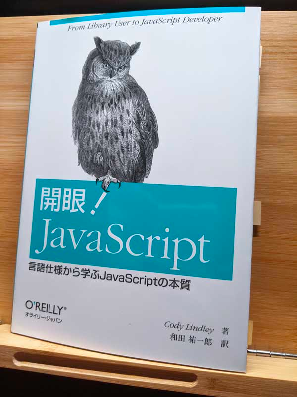

## はじめに

今まで業務でも（社内向けページ作成などで）JavaScript を使っていましたが、今までは他の人のコードを参考にしたり、都度調べたりなどして書いていました。

が、ちゃんと言語としての仕様や中身を知っておかないと、と最近思い始めていた最中、たまたま本屋で見つけてチラ見して良さそうだったので買って読んでみました。

<iframe style="width:120px;height:240px;" marginwidth="0" marginheight="0" scrolling="no" frameborder="0" src="//rcm-fe.amazon-adsystem.com/e/cm?lt1=_blank&bc1=000000&IS2=1&bg1=FFFFFF&fc1=000000&lc1=0000FF&t=nabalog-22&language=ja_JP&o=9&p=8&l=as4&m=amazon&f=ifr&ref=as_ss_li_til&asins=487311621X&linkId=d8b94601268ff3259506583c373d104c"></iframe>

ボリュームは167ページ（しかもA5サイズ）なのでオライリー本としては非常に読みやすく、サクッと読めました。

忘れないうちに感想などを書いておこうと思います。

<!--more-->

## ざっくり内容

本書の「はじめに」などにも書かれていますが、この本は JavaScript を初めて触る人向けの本ではなく、「なんとなく書いていたけど実際中でどう動いているのかよく分からない」人向けです（まさに自分のような人）。 
なので、「関数とは」「変数とは」「式の書き方」など基本的なことは書いておらず、いきなりオブジェクトの話から始まります（JavaScript はオブジェクトが本質とのことなので、正しい始まり方だと思います）。

といいますか、**この本の大半はオブジェクトの話**です。

オブジェクトの挙動を正しく理解することで、オブジェクトから派生した様々な機能を理解することができる、といった内容です。

また、関数（これも本質はオブジェクト）についても細かく書いており、なんとなく使っていた `this` や `prototype` がどういうものなのか、どう利用されているのか、などを知ることが出来ます。 
（個人的にはここが一番の推しポイントです）

自分が参考になった内容を挙げておきます。

* `new Number(0)` と `Number(0)` と `0` の違い
* 値のコピー、参照渡しの挙動
* `delete` 演算子
* `for (var key in obj)` などの挙動
* ブラウザでどこでも使える `window` とはなにか（windows の中身の説明はないですが、何者かは書いてあります）
* スコープチェーン、プロトタイプチェーン、継承
* クロージャ
* 配列の `length` の挙動
* `String(x)` や `Number(x)` の x にどういう値を入れたらどうなるか

## 注意すること

この本は2013年に初版が発売され、そのままの本です。 
ECMA-262 Edition 3 の内容がベースで書かれており、情報自体としては古いものになります。

https://developer.mozilla.org/ja/docs/Web/JavaScript/Language_Resources

ただ、オブジェクトの本質動作などは変わっていない（はず）なので、2021年現在でも十分有用な情報（特に自分みたいになんとなく JavaScript を書いていた人などにはピッタリ）だと思います。

また、サンプルコードが充実しているので、是非自身の Chrome のコンソールや JSFiddle などで動かしながら試してみると良いと思います。

## おわりに

この本を読んだだけで JavaScript の内部構造が分かるわけではありませんが、今までなんとなく使っていてモヤモヤしているような人には、おすすめの本だと思います。

1度読んだだけでは理解できない（特に construct や prototype 周りは今説明しろと言われても自信がない）ため、手を動かすなどしながらもう少し読み返したりしてみたいと思います。