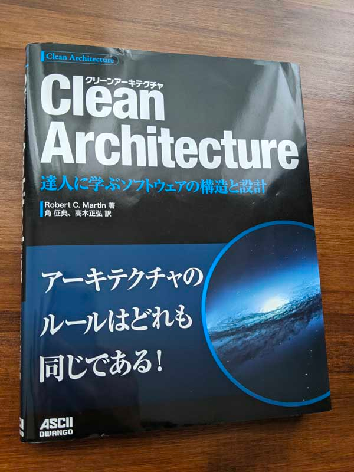
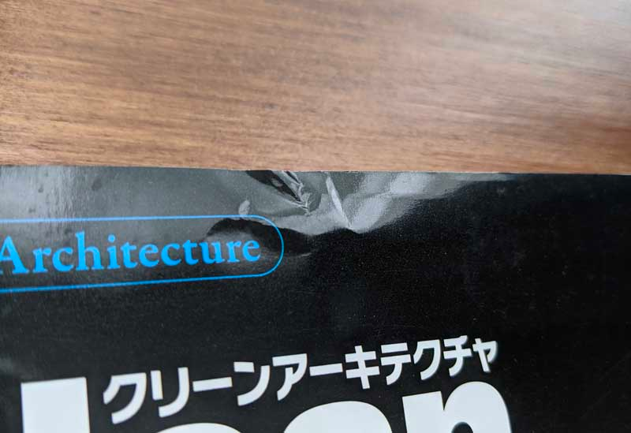
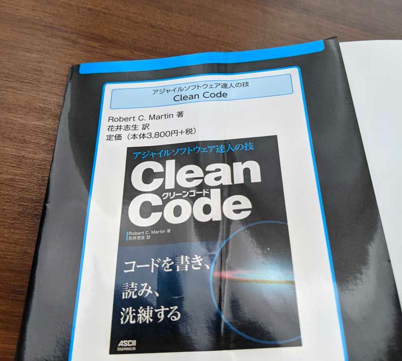
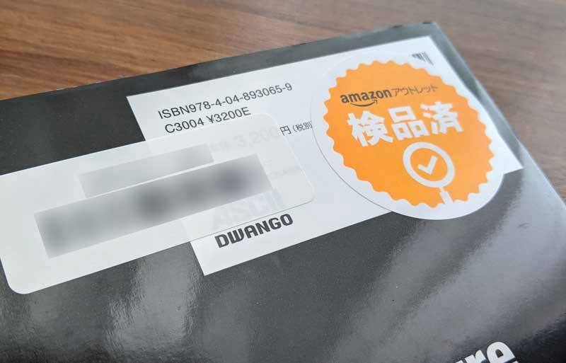

## はじめに

欲しかった本が amazon アウトレット品という状態で売られていたので、買ってみました。



購入時の周囲事項には以下の記載がありました。

<!--more-->

> コンディション： 中古品 - 可 - 商品には関連するメディアが含まれていない場合があります。 カバーに中程度の損傷. ダストカバーに大きな損傷.

との記載がありました。

https://www.amazon.co.jp/Amazon%E3%82%A2%E3%82%A6%E3%83%88%E3%83%AC%E3%83%83%E3%83%88/b?ie=UTF8&node=2761990051

ググると同じ文言の状態で買った人がいて、特に品質に問題はない、とのことだったので、試しに買ってみました。

どうせ新品で買ったとしても、自分で不慮の事故で傷をつけることはあると思いますしね。

あ、ちなみに買った本は Clean Architecture です。ずっと欲しい物リストに入れっぱなしだった。

www.amazon.co.jp/dp/B07FSBHS2V

## 届いた状態

数日後、いつも通り Amazon の簡易包装で届きました。

パット見の感想は「使用感がある中古の本」というイメージです。

表紙カバーに大きな折れが見えるものの、「ダストカバーに大きな損傷」（てっきりビリビリになっているかと思った）と比べたら全く問題ありません。

### 検品済みシール

裏側のJANコードなどが書かれている場所に、「amazon アウトレット 検品済」のシールが貼ってありました。

ちなみに比較的剥がしやすいシールでした（一発ではいけなかったですが）。

## 本の中身は問題はない

汚れや傷があったのはカバーだけで、中身についてはパット見汚れなどもなく問題はなさそうです。

奥付も確認しましたが、（本自体は古いものの）版は新しかった（1年以内だった）ので、変に古いものが流れてきたわけではなさそうです。 
本当に説明通り、倉庫に置いておいて何らかの理由で傷つけてしまい、アウトレット品にならざるを得なかった、といったイメージがあります（もしくは返品した人の扱いが悪かったか）。

ともあれ、知りたいのは中身ですので、無問題です。

## とりあえず amazon アウトレット品でも問題なかった

今回 amazon アウトレット品により、税込定価3,520円の本を2,781円（約2割引）で買うことができました。

この本に関しては Kindle 版も出ていますが、どうしても紙の本で欲しかった（技術書は紙の本で持っておきたい派）のでお得に買えてよかったと思います（というか Clean Architecture がプレミア価格みたいになってる）。

機会があればまた利用してみたいと思います。

