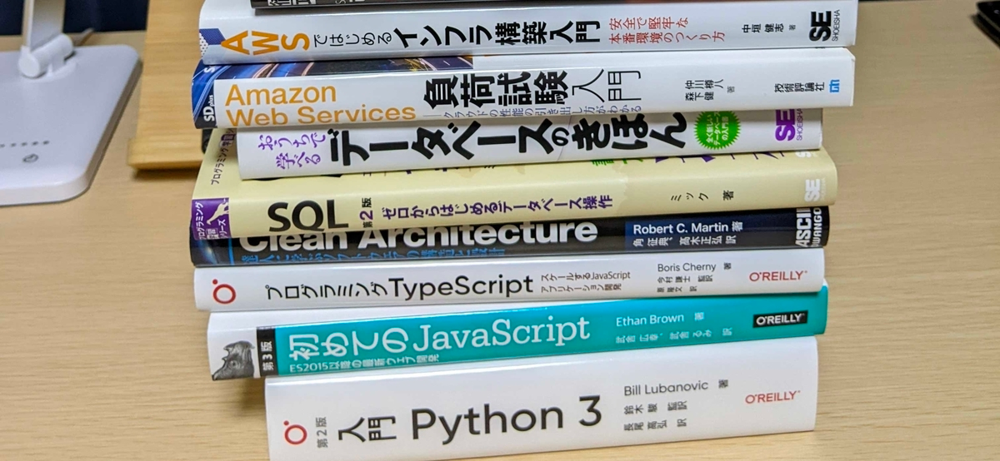

## はじめに

遅くなりましたが、あけましておめでとうございます！

2021年にやったことと、2022年にやりたいことをまとめておきます。 
今年も早速心が折れそうですが、めげずに頑張っていきたいと思います(｀･ω･´)ゞ

## 2021年にやったこと

去年にやりたかったことは大体達成できたのでは、と思います。

* 勉強
    * 20冊ぐらい多分読みました
      
    * AWS SAA に合格できました
* 仕事
    * 転籍しました
      
* 生活
    * 引越し
* 趣味（ピアノ）
    * CDは作れませんでしたが、新曲を2曲出せました
      
      

## 2022年にやりたいこと

* 勉強
    * FP3級に合格する（1月23日試験予定）
    * 技術本など20冊を読む
    * 秋期PM試験受ける（もちろん出来れば合格したい）
    * 英語勉強頑張る（現在Duolingoで基本的なところから叩き直してる）
* 仕事
    * 人数の少ない職場なので、早く慣れて第一線になる
* 生活
    * 引越しの予定はないが、いい物件があれば引越しも検討
        * 防音室（歌いたい）
        * 駐車場付き
        * 新宿までドアtoドアで1時間ほど
* 趣味（ピアノ）
    * 作曲の土台作りとして、作曲理論を身に付ける（着手中）
    * YouTube に自曲の演奏動画を上げる
    * 冬コミで新譜を頒布する（毎年言ってるなこの人）

## お気持ち的な話

当たり前な話ではありますが、自分は飛び抜けた才能があるわけではなく。。 
寝る間も惜しんで努力できる覚悟もないし、登壇できるほどの技術力もない。

なので、Twitter や YouTube で活動している人を見ると
「なんて自分はできないんだろう」なんて思ってもしまいますが、 
悔やんでも仕方がないので、人と比べず、自分は自分のペースで頑張っていきたいと思っています。

ちりつもちりつも。

いつか努力が実を結ぶと信じて。

## 何はともあれ

ゆるっと、今年もよろしくお願いします！