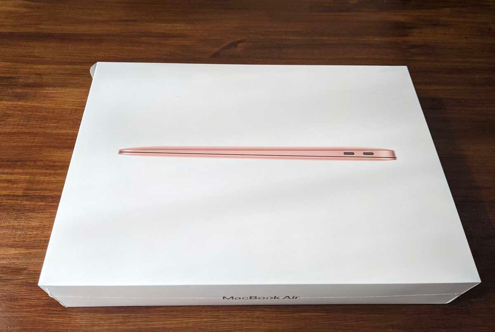
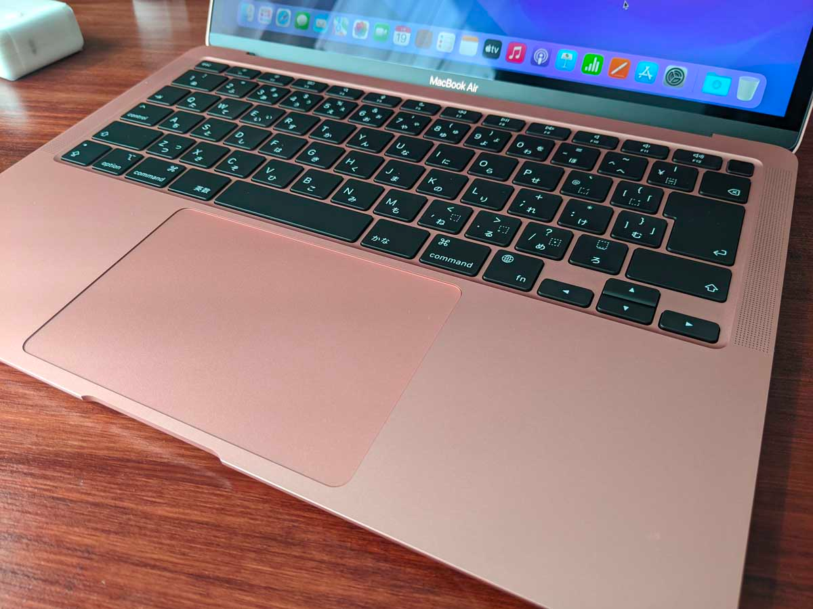
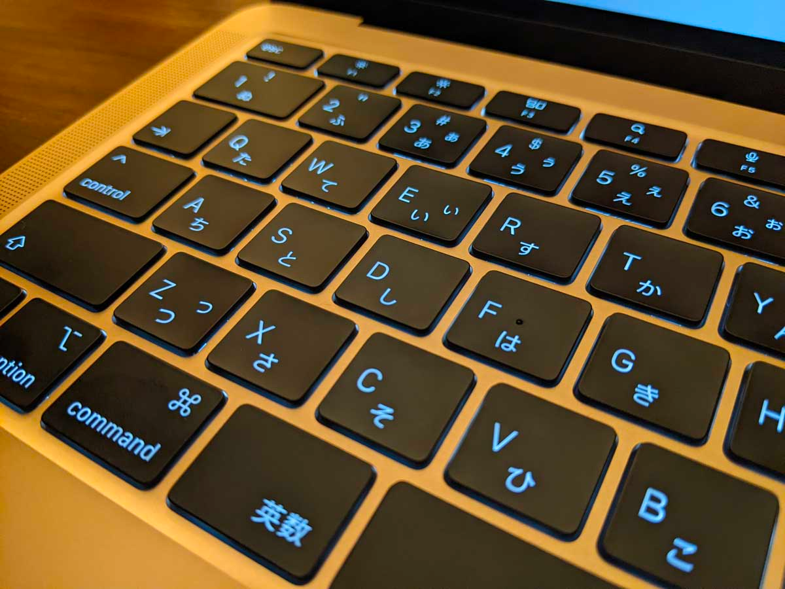
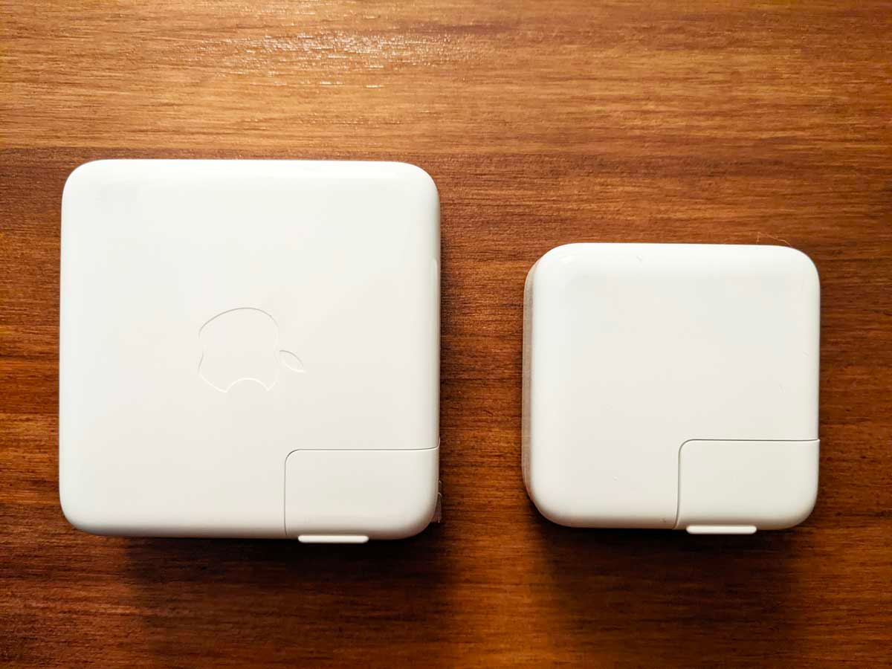

そろそろ持ち運び用、また開発用に Mac が欲しいと思ってはいましたが、3月の Apple Event では新型 MacBook Air は発表されず…。 
新型は2022年後半なんて噂も飛び交っていてもう待ちきれないと思い、多少遅くなった感はありましたが M1 MacBook Air をポチりました。

スペックは、M1（CPU 8コア, GPU 7コア）、メモリ 16GB、ストレージ 512GB モデルです。

Unity など重い開発をするわけではないため、Pro ではなく Air を選びました（Pro と比べたら安いしね）。

ということで、なんとなくのファーストインプレッションです。

<!--more-->

## 見た目

初期セットアップを終えたところ。

色はゴールドを選びました。 
iPhone 6 のゴールド色を持っているのでその色のイメージを持っていましたが、実際に開けてみた感想は「ピンク！」でした。 
とはいえ、ほんのり赤みがかかっているような色味で、むしろこれから春を迎えるにあたり桜の色のように感じて気に入っています。

## 初めての M1

会社から支給されている MacBook Pro は Intel チップなので、これが初めての M1 との邂逅でした。 
最近では M1 Pro やら Max やらが出てきているので、それと比べると1年前に出た M1 はスペックが足りないんじゃないか…なんて心配もありましたが、今のところ杞憂に終わりそうです。

一通り入れたいアプリやら環境構築をしていましたが、普段使っているデスクトップPC（Core i5-8400）と比べても各種インストールなどが遅いということもなく。 
M1 のベンチマークスコアが高いとは聞いていましたが、ここまでサクサク動くと思っていなかったため非常に驚いています。

今のところ、PHPStorm, Photoshop などは快適に動いています。

## ファンレス

この MacBook Air はファンレスです。 
あまりにも静かすぎて、重いインストールなどを走らせているときに幻聴が聞こえるぐらいでしたが、本当にファンレスのようです。



まだCPUをがん回ししているわけではないため、これからどれぐらい本体が熱くなっていくのかは未知数ですが、動画を再生していたりずっと作業を続けていると多少本体が暖かくなります。 
キーボードの上部（画面との間）が熱くなりやすいようですが、普段触らないところなので問題はないでしょう（ヒートシンク代わりに10円玉でも置いておくか？）。

## キーボードが心地よい

以前会社から支給されていた MacBook Pro は、バタフライキーボード（通称パタパタキーボード）でした。 
自分はそこまで嫌いではなかったのですが、音が結構する、押した感がない、故障しやすいなどと、私の周りでは結構不評でした。

今回の MacBook Air は、シザーキーボードへ戻り今までのキーストロークで快適に打鍵をすることができます。 
またクッションが入っているのか、そっと押せば静かに打鍵することができるのも結構好きです。

## スピーカーの音質がかなり良い

キーボードの両側にスピーカーがあります。

初めて Mac を開いたときに鳴る「ブーン音」（今は設定で無効化しましたが）がかなり高音質で驚きました。
ただ鳴っているというわけではなく、YouTube などで音楽を流すと多少立体的に聞こえてきてどこから鳴っているのか分からないぐらいで、力を入れていそうということがわかりました。

もちろんスピーカーのサイズ的に低音が鳴るというわけではありませんが、普段から音楽を流しておいても気にならない程度の音質でした（個人の感想）。

## 電源アダプタが小さい

M1 MacBook Air が 30W の電源アダプタ、会社支給の MacBook Pro が 61W 電源アダプタで、電源アダプタを比べてみると全く大きさが異なっていました。 
コンセントに刺したときに電源アダプタ自身の重みで傾いたりといってことが無さそうな大きさです。

重さも 61W の電源アダプタに比べると軽いので、普段から持ち運ぶ場合でも Pro よりは苦になりにくそうです。

## まとめ、これから

半日使ってみてのファーストインプレッションは、大変満足でした。 
デザインよし、スペックよし、エクスペリエンスよし！

環境構築やら、プログラミング環境としてはまた別の記事で書きたいと思います。

あと傷が付かないようにケースもポチったので、届いたらまた記事を書くかもしれません。

