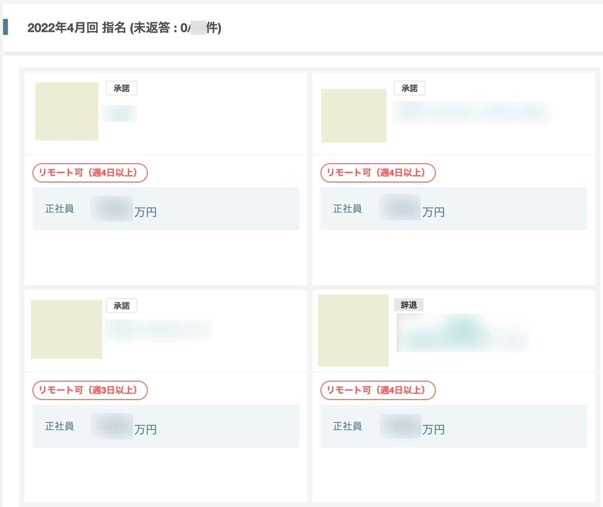

## はじめに

ここ数年、新たな挑戦や技術力の向上のために転職をふわっと考えていて、なんとなく転職ドラフトに登録してみたらトントンと話が進んで転職することができたので、そのレポート記事になります。

この記事は `転職ドラフト体験談投稿キャンペーン` に参加しており、キャンペーンの対象記事の記載例を参考にしつつお届けします。

<!--more-->

[転職ドラフト体験談投稿キャンペーン｜転職ドラフトReport](https://job-draft.jp/articles/251)

## 転職ドラフトに登録したきっかけ

転職ドラフト自体は昔から聞いたことがありましたが当時は転職意欲がそこまで高くなかったため登録はしていませんでした。
ユーザー名やメールアドレスの登録欄に正規表現が書いてあり、エンジニアを意識しているなぁと感じていました。

いざ転職活動をしようとした際に、転職ドラフトを思い出し

- どうせならエンジニアに特化した転職サイトが良い
- 指名年収が先に分かる（90%ルールにより、内定時のオファー額は指名時の90%以上という制約がある）のは安心感がある
- 転職プレゼントが豪華

  [2021年10月1日より、転職成功プレゼントをリニューアルしました｜転職ドラフトReport](https://job-draft.jp/articles/545)

といった理由で、転職ドラフトに登録をしました。
（転職活動でバタバタしすぎるのも嫌だったので、他のサービスには登録しませんでした）

## 転職ドラフトでの指名状況

初参加の人にはかなり指名が来るイメージがあります。

私の場合は、初参加で30件以上の指名をもらいました。希望年収を記入しなかったため、振れ幅は広くありました。

指名数ランキングを見ると、きちんとレジュメを記載している人であれば、初回は数十件の指名が来ることがありそうです。

その中で、数件のみ指名を承諾し、企業とのやり取りを開始しました。

働き方などの前提条件を話し合いつつ選考へ進み、結果1社から内定をいただくことができ内定承諾をしました。

## 面接で感じたこと

予めレジュメを読んだ上で指名してくれているということもあり、こちらに興味を持っていただけているということを肌で感じることができました。

経歴ややりたいことについてもレジュメを補足する形でお話をすることができ、スムーズに認識合わせを行うことができたと感じています。

## 転職ドラフトを使ったことがない方へのメッセージ

レジュメを正確に書くことで、市場において正当に評価された年収をもって指名をもらうことができると思います。

転職意欲がそこまで高くなくてもドラフト自体には参加することができるため、一度市場価値を確かめるという意味でも参加してみても良いかもしれません。

ちなみにお友達紹介キャンペーンというものがあり、紹介コード `KIRA`  を入力してレジュメの審査に合格すると、お互いに好きなO'Reilly本（5,000円以下）をもらうことができるので、よかったらどうぞ。（宣伝）