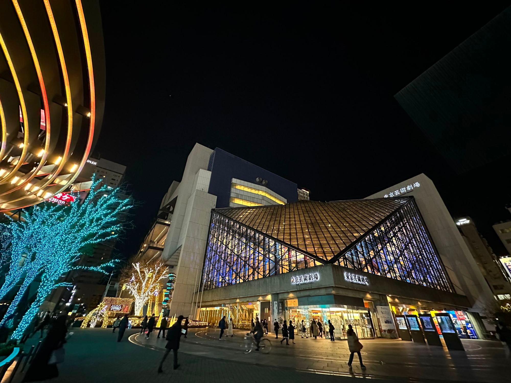
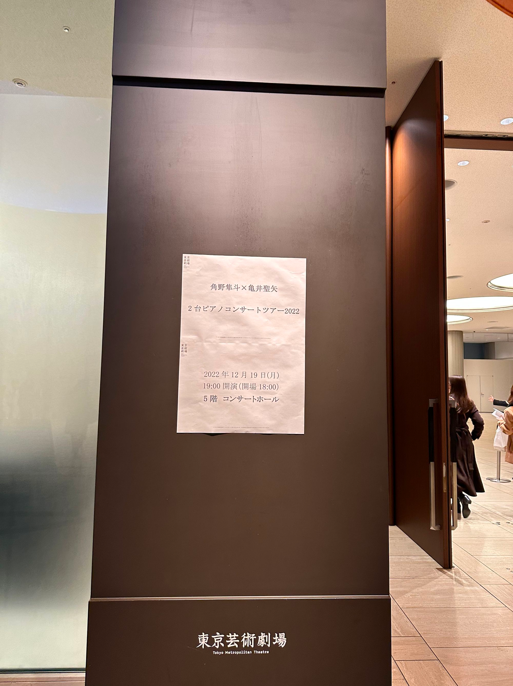

お二人の技術力が高いのはもちろんのこと、細かい指のパッセージや歌うメロディが本当に綺麗だった。

<!--more-->

亀井さんがソロで弾いていたバラキレフの「イスラメイ」が重厚感溢れてかっこよかった。

ピアノの音量の感覚は知っているけど、2台で弾くと想像以上の音の厚みと響だった。スタインウェイのフルコンというのもあるのかなぁ、下も上も音色が本当に綺麗だった。

どうしたらこうも二人の息が合うのか…二人がそれぞれ歌うことで曲が1つにまとまっていた。