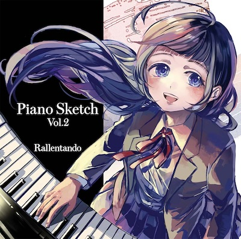

あっという間の2023年でした。

近況の振り返りやら、来年の抱負とか書こうと思います。

<!--more-->

## お仕事

2022年9月に転職してから、気付けば1年4ヶ月が経過しました。

プロジェクト内での動き方や自分の良いところが出せるようになってきたかなと思う一方で、 技術力は社内のメンバーが強いので負けないようにしたいなーと思ってます。
強い人からおすすめの本など紹介してもらったので頑張って読みます。

また所属している会社の英語化が進んでおり、母国語が日本語ではない方が増えてきた中で自分はあまり英語が得意ではないので、取り残されないように英語の勉強はしっかりやっていきたいと思います。
いつもやるやる詐欺なので、今度こそやります。。

## 同人/作曲

今年は夏に久々にコミケに参加して曲を発表することができました。

コミケ当日は、たくさんの方にお手に取っていただいて本当にありがとうございます。

HPからクロスフェードは聞くことができます。
もう少ししたらサブスク配信にも流そうかなと思います。

https://rallentando.net/

来年の夏コミへの申し込みは現在考えていないですが、また機運が高まってきたら次のアルバムを作る予定です。

Piano Sketch Vol.2 はいろんな方に手にとっていただけた一方で、自分としては曲の仕上がりに満足が行っていない部分もあったりするので、次回Vol.3はより良い曲/楽譜が作れるようにしていきます。

## プログラミング

趣味で作りたいプログラムがあります。

色んな方が挑戦されていると思いますが、「ぼくが考えた最強のノートアプリ」を作ろうと思っています。
自分がどう思考を整理して、アプリはそれをどうアシストするかにフォーカスしたアプリです。

様々なノートアプリを試してみて、あと一歩というところまでは来るのですが、しっくりくるアプリがありませんでした。
やりたいことが達成できたとしても、それはアプリ（ツール）の機能に使われて達成しただけで、直感的思考とは結びつきませんでした。

ということで、自分もITエンジニアの端くれとしてもう自分で作るしかないと覚悟を決めました。

ゆっくりのんびり作ってみて、自分で運用ができる形までもってくることができたら、公開を考えようと思います。

## さいごに

2023年はバタバタした生活だったので、2024年は心休めてゆったりと過ごしていこうと思います。
自分のペースを第一に、健康大事に。もう若くないし。

来年もよろしくお願いします！
