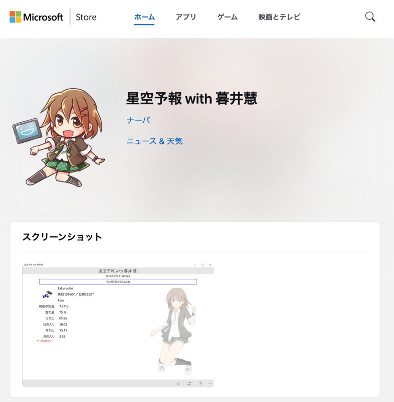
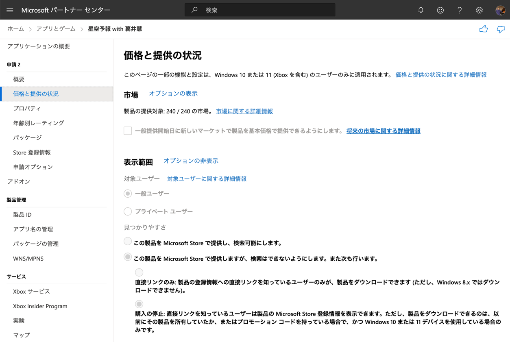
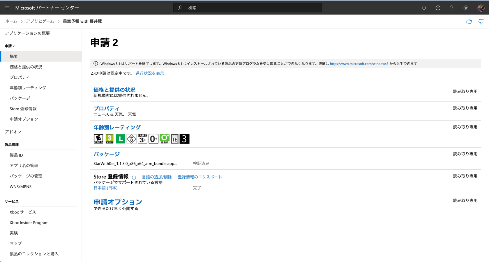
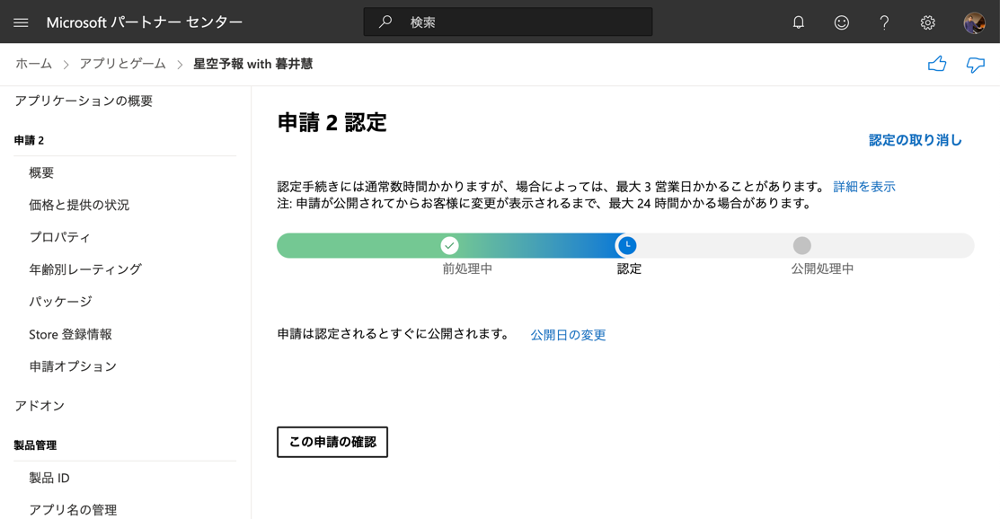

Microsoft Store で配布していたアプリの開発環境が残っておらず更新ができない（する予定もない）ため、閉じることにしました。

今回閉じるのは下記のアプリです。

<!--more-->

ストアページ
https://apps.microsoft.com/detail/9NBLGGH4RJV9

2016年にプロ生@金沢に合わせて作成したアプリでした。
懐かしいですね。。



## 公開停止手続き

[Microsoft パートナー センター](https://partner.microsoft.com/ja-jp/dashboard/home)から対象のアプリを選択し、新しい申請を作成します。
「価格と提供の状況」から「購入の停止」に変更し、申請を出します。

申請後、申請ステータスは随時確認することができます。

申請を出したのが2024/01/07(日) 13:00頃で、実際に申請が通って購入停止になったのが、◯◯でした。

## おわりに

そういえばMicrosoftの開発者登録は買い切りだったと思います。
またいつかストアに出せるアプリを作成してみたいですね。
