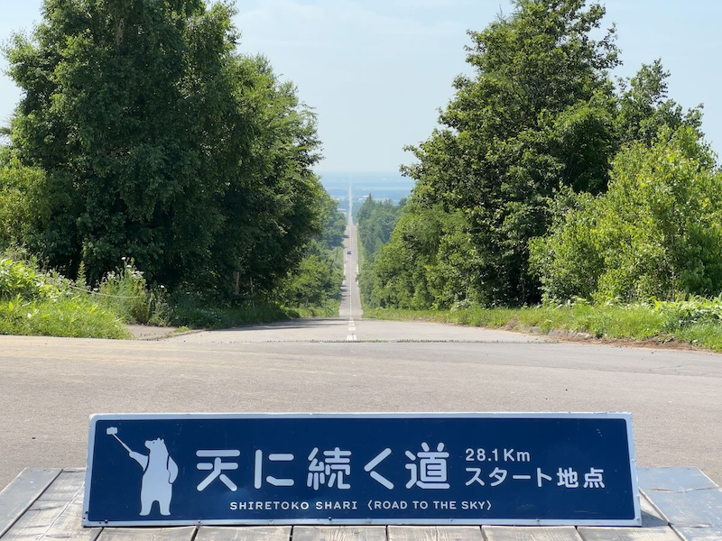

## はじめに

早いもので2024年も1月が終わろうとしています。
月並みですが、時間の流れはあっという間です。

先日健康診断を受けましたが、1月23日生まれでもうすぐ31歳を迎える私は、30歳を超えたあたりから結果で悪いところがないかを不安になるようになりました。

また、テレビや世界で活躍する若手がどんどん年下になり、それを認識するたびに「私は誰かの役に立つことなんてできるのだろうか」と自己嫌悪に陥ることがしばしばあります。

このままだと何もしないままモヤモヤを抱えて人生が終わってしまうのではないかと不安に思うようになり、そもそも人生とはなんだろうと考えることが多くなってきました。
今回その考え方を整理するために、自分のために、ついでにアウトプットとして記事にしました。

※かなり私見が入っているのでご了承ください。

<!--more-->

## 昔思い描いていた人生にはなっていない

思い返せば、私自身は人生が思い通りになったことはほとんどありませんでした。

学生の頃は、当時付き合っていた恋人と結婚すると思っていましたし、社会人になってから出会った人と結婚した頃は、数年後には子供ができて家も建てると思っていました。
しかし現実は、長い年数付き合ってる彼女であっても別れますし、結婚しても子供も家も叶うことなく離婚をします。
ここ数年のコロナ禍もそうですし、2024年も年始めから色々ありました。

極論、1秒先のその人の人生のことは誰にも予測できないと、最近実感しています。
人生計画の立て方も、なかなか難しそうです。

## 人生ってなんだろう

weblioで引いてみました。

> １ 人がこの世で生きていくこと。また、その生活。「第二の—を送る」「—を左右する出来事」「—経験」
> ２ 人の、この世に生きている間。人の一生。生涯。「芸術は長く—は短い」
> 
> 引用: [デジタル大辞泉](https://www.weblio.jp/content/%E4%BA%BA%E7%94%9F)

「この世」というのは、死後の世界とかそういったものは含まず、科学的な今のこの現実と解釈します。
「生きていく」というのはまさしく心臓が動いている間、自分という意識が認識できる間と解釈します。

今回は、人生を **「対象の人間（この場合、私自身）がこの現実世界で、生まれてから死ぬまでの間にどのような生活を送り、どのような出来事があるのか」** という解釈にします。

死後の世界ってなんだろうなぁという非科学的なことも考えてしまうこともありますが、今回の記事の範疇からは外します。

## だれのための人生か

以前、アドラーの心理学に関する『嫌われる勇気』という本を読みました。
哲学的な話で賛否両論あるようですが、私なりに解釈して、主に以下の点が参考になりました。
* 悩みというものはすべて人間関係に起因する
* 考え方を変えることができれば、今この瞬間から幸せになれる

極論を言ってしまうと、他の人間誰とも干渉しなければそこに文化もルールも悩みも存在しないので、人生を考える必要もなくなります。
しかし、人は社会的動物であり、人間と干渉せずに生きることは現実的に難しいです。
（人工物に囲まれて生きてきましたし）

ただ整理したいことは、あくまでも人生というのは個人そのものの話であり、人生に深い関係を持つ人間には干渉されないということです。
どんなに親しい友人であっても、家族であっても、当人の人生を決めることはできないと思っています。

## じゃあ私はどう生きるか

※ちなみに私は例の映画は（まだ）見ていません。

自分の人生は自分で決めることができるという当たり前のことを整理したところで、私はどう生きるのか考えてみます。

結論を先に書くと **「他人と比べず私がやりたいと思ったことを達成するための時間を過ごす」** と私は考えました。

### 他人と比べず

人は社会的動物であるため、他人と無意識に比較してしまうことが多々あります。
* 〇〇で1位になる
* 平均年収を超える
* 〇〇さんを幸せにする
* etc

ある程度人生にメリハリをつけるために他人と比べたり他人を利用することは問題ないと思っていますが、そこにこだわりすぎたりそれ自身を人生の目的にしてしまうと、自分の人生や自分のモチベーションを他者に依存することになってしまいます。
折角自分の人生の意義を自分で決められるのに、そこを他者に依存してしまうと、多分、正直、疲れます。

### 自分がやりたいと思ったことを達成する

他者と比べないこと、という意味ですね。
「誰かがやっているから自分もやる（話を合わせたり、流行に乗る）」というのは、また自分の人生やモチベーションを他者に依存することになります。
それでは、他者が「こうした方が良い」というと自分の人生が変わってしまいます。

いい意味で欲望に忠実になり、やりたいと思うからやる、自分は興味がないからやらない、の線引きはつけて考えたほうが良いと思いました。

一度やると決めたことは、あとから変えてもいいのです。
自分のことは自分で決めるべきなのですから。
もちろん、他人に迷惑をかけすぎないというのは前提ですが。

## 現時点の私の人生の生き方

以上のことを踏まえて、現時点の私の人生の生き方、意味を考えてみます。

### ピアノ

ありがたいことに中級者程度のピアノの実力と絶対音感を身につけ、ピアノは私にとって特別なものになりました。
人生を考えたときに、身近にピアノがあったから今の私があると思っているので、これからもピアノを弾き、触れていくものにしたいと思います。

自分が弾きたいと思った曲を弾き、こういう曲が聞きたいと思う曲を自分で作り、人生の相棒と呼べるピアノを手に入れることが人生でやりたいことです。

### ITエンジニア

ITエンジニアという職は私にとって天職とまではいきませんが、人生でPCを触り続けてきた私には向いている職業です。

生きるためにはどうしてもお金が必要です。
人並みにはお金が稼げていますし、人生を楽しむためのお金稼ぎの手段として、ITエンジニアという職業は現状私にとって最適だと思っています。

これから先、人生をかけてITエンジニアを極めていく覚悟は正直今はまだありませんが、IT技術はもちろん好きですし、プライベートの時間でアプリを作りたいと思うぐらいにはエンジニアを楽しんでいるので、引き続き仲良くしていきたい項目です。

### マイホーム

私は都会も好きですが、どちらかというと田舎が好きです。
※田舎の定義については様々な意見があると思いますが、ここでは山・川・海などの自然が身近ににある街、ぐらいを田舎とします。

昔から家、特に一軒家が好きで、家作りやリフォームのテレビや動画を好んで見てきました。
今でも賃貸ながら机や棚をDYIで作って楽しんでいます。

自然豊かな環境で、家の構造であったりインテリアであったり、自分が思い描いた家に住んで好きなように暮らしたいという夢は今でも持ち続けているので、必然的にマイホームを手にすることが人生でやりたいことになります。

### パートナー

以前結婚した際のことを思い出してみると、当時の私の考えは、結婚することが当たり前で、意味を深く考えたことはありませんでした。
お付き合いして、その先に結婚があるのでプロポーズして、新婚生活があったらどこかのタイミングで子供を作り育てて家族第一で生きることが当たり前だと思っていました。

しかし離婚してそのレールが崩れたことで、結婚の意味をちゃんと考えるようになりました。
結婚することで人生が制限されるので 、結婚しないほうが一人で自由に生きれて幸せだと思うこともありました。

しかし、人生の意味を「自分がやりたいと思ったことを達成するための時間」と捉えて考え直してみると、パートナーを持つことの人生へのポジティブな影響が多いことに気付きました。
何年も同じ時間を過ごし喜怒哀楽を共有することで、人生を楽しみ合う。
一人ではできないことを、一緒に達成することができる。
身も蓋もない話だと、急病のときに物理的に助けてくれる。

**基本的には自分の人生を自由に生きつつも、パートナーがいることで人生をより豊かにすることができる。**
そのような考え方に共感してくれる人をパートナーに持ちたいと、徐々に思うようになりました。

### その他趣味たち

その他の趣味は人生の意味というよりは、続けて楽しんでいきたいという意味合いでやっていきます。
息抜き必要。

* スキー（スノースポーツ）
* ドライブ、旅行
* etc

## おわりに

色々書きましたが、私としては折角この世に人間という自由な動物に生まれたので、自分なりに自分のやりたいことを決めてそこに向かって、仕事もプライベートも明確に分けずに、自分の意識を持って、人生を過ごしていきたいと思っています。

もし、誰かの悩みのヒントになれば幸いです。

## 参考

* [人生という貴重なリソースを何に使うかという話](https://soudai.hatenablog.com/entry/2017/06/19/042258)
* [嫌われる勇気](https://www.diamond.co.jp/book/9784478025819.html)
* [サピエンス全史　上](https://www.kawade.co.jp/np/isbn/9784309226712/)
