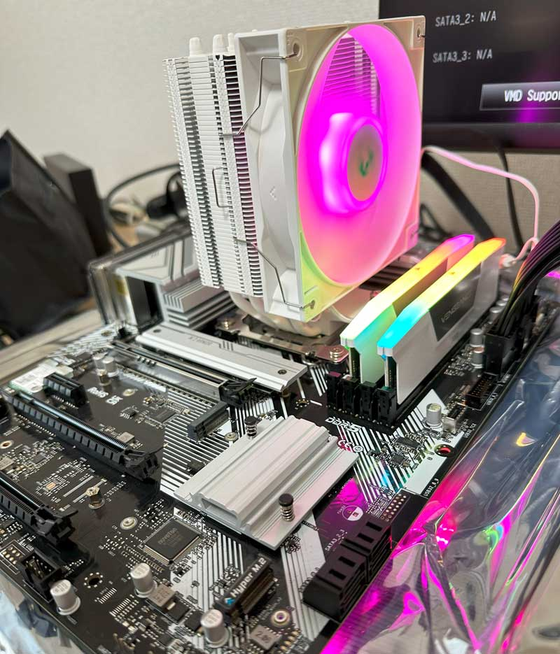
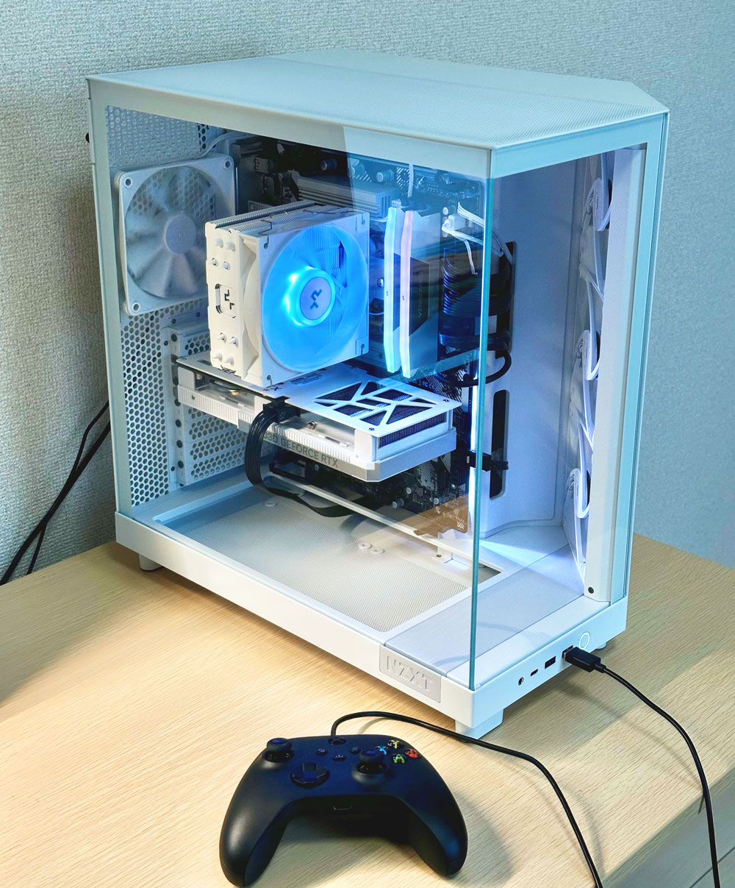
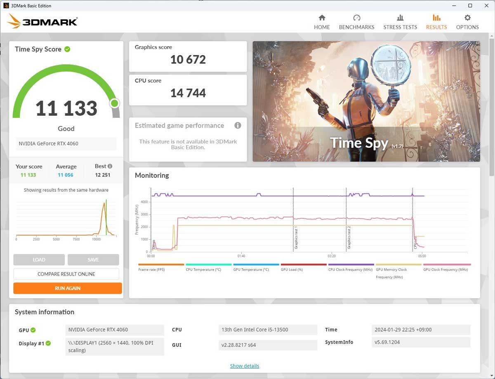
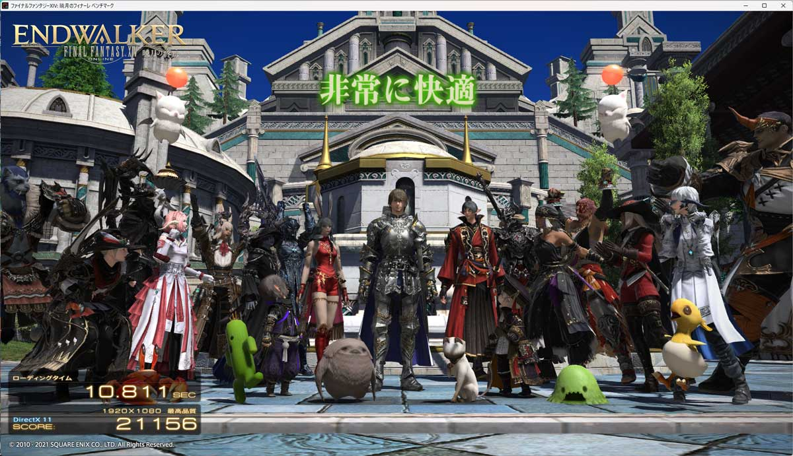
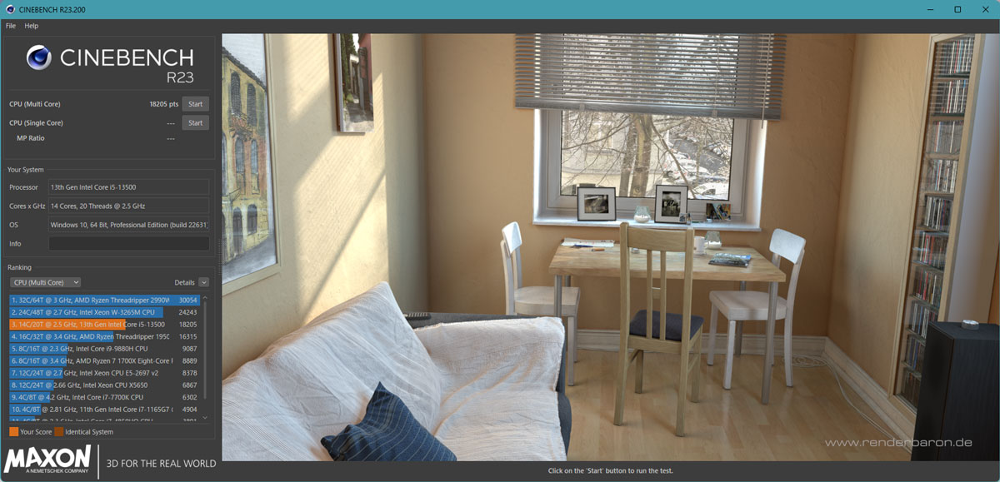

6年ぶりに自作PCを組みました。

ここ1年ぐらいは以下のスペックのゲーミングノートPCを使っていました。
* CPU: Core i7-7700HQ
* Mem: 16GB
* GPU: GeForce GTX 1050 Ti Mobile

最近のゲームではちょっと重くなってきて満足に遊ぶことができなくなってきたので、快適なゲーム体験を求めて、新しいPCを組むことに決めました。

<!--more-->

## 自作するか買うのか

まず、組むか、新しいゲーミングPCを買うか考えてました。

### 組む場合
* Pros
  * 好きなスペックにできる
  * ケースも選べる
  * 久々の自作PCを楽しめる
* Cons
  * パーツの相性が不安
  * 持ち運べない
  * 何だかんだいい値段する

### 買う場合（ゲーミングノートPC）
* Pros
  * 製品に対するサポートがある
  * 好きな場所に持ち運べる
* Cons
  * 好きな見た目を選べない
  * パフォーマンスがデスクトップ版よりも下がる
  * カスタマイズすると自作PCよりも費用がかかる

同じ費用でパフォーマンスを取るのか持ち運びを取るのかを考えて、そこまで頻繁に持ち運ばないだろうということで、組むことにしました。

## 組むにあたって求めること

以下の条件でパーツを考えました。

* 遊びたいゲームが遊べること
  * 龍が如くシリーズ
  * Cities Skylines 2
  * Minecraft with 影MOD
* 見た目がおしゃれなこと
  * これは考えていく中で最近流行りの「白」に統一することにしました

## 組んだもの

ということで、組みました。

最高画質でのぬるぬるは青天井なので、予算20万で以下で組みました。
ちなみにキーボード、マウス、ディスプレイは既存のものを引き続きとりあえず使っています。

### マザーボード: AsRock / B760 Pro RS WiFi
https://kakaku.com/item/K0001566725/
* このモデル、日本だとドスパラしか売っていない説？
* 裏側光ります（BIOSで設定変更可能）

### CPU: Intel / Core i5-13500
https://kakaku.com/item/K0001506430/
* 20スレッドの世界へ（異次元）
* i5なのに3万8千円か…昔はi7-2600Kでも3万円しなかったのに…

### CPUクーラー: DEEPCOOL / GAMMAXX AG400 WH ARGB
https://kakaku.com/item/K0001551751/
* リテールクーラーでもよかったのですが、折角なので白色のクーラーを探しました
* ついでに光る（BIOSで設定変更可能）
* 水冷は興味ありましたがちょっと自身なかったので一旦今回は切り上げ
* ちなみにケース高さギリギリでした（あまり調べてなかったので取り付けた後焦った）

### メモリ: Corsair / CMH32GX5M2B5200C40W (DDR5 PC5-41600 16GB × 2枚)
https://kakaku.com/item/K0001461122/
* 無駄にDDR5です
* 白っぽいものを探した
* メモリ自体はDDR-5200対応ですが、電圧の調整が必要なのとCore i5-13500だとDDR5-4800までの対応っぽいのでちょっと無駄です
* ついでにレインボーに光る。ユーティリティソフトで色はいじれる

### ストレージ: WESTERN DIGITAL / WD_Black SN770 NVMe WDS100T3X0E (1TB / M.2 Type2280)
https://kakaku.com/item/K0001424274//
* M.2なのは必須で、あとは1TBで速度そこそこのものを選びました

### GPU: Inno3D /  GeForce RTX 4060 TWIN X2 OC WHITE 8GB
https://kakaku.com/item/K0001538511/
* 白いグラボかっこいい
* Inno3Dは香港の会社のようです
* マザボに挿す時少しメキメキと音がして怖かった（大丈夫だった）

### ケース: NZXT / H6 Flow CC-H61F
https://kakaku.com/item/J0000042943
* これが一番重要、自作PCの醍醐味
* 色々調べていく中で、ほぼ一目惚れ
* 2面ガラスでベゼルレスって美しすぎないか？
* 1万7千円ぐらいしたけど大満足

### 電源: MSI / MAG A750GL PCIE5 (GOLD / 750W)
https://kakaku.com/item/K0001553668//
* GOLD以上
* 容量は余裕持たせる
* プラグインタイプ

### OS: Windows 11 Pro
https://kakaku.com/item/K0001432814
* リモートデスクトップとHyper-Vのサポートを利用するためにこのバージョンにしました

## ベンチマーク

## 終わりに

価格そこそこに最新のゲームもサクサク動くバランスの良いスペック＋見た目にできたと思います。

Windows 11 のインストール自体は数分で終わるなど、昔と比べるととっっても快適でした。
Windows Me -> XPアップグレード環境を何度かセットアップしたことがありますが、まずMeから入れ直さないといけなくて、それに2時間、そこからService Packを入れて、更にXPへのアップグレードして、またService Pack入れて……と、半日ぐらい取られていたのを覚えています。

ちなみに起きたプチトラブル
* Windows 11 Proの初期セットアップ時にインターネット環境が必要で、WiFiモデルだからなんとかなると思いましたが、イーサネットしか認識しておらず、仕方なく有線環境を用意してセットアップしました。その後OSが立ち上がったあとにWiFiドライバを入れたらちゃんと認識しました
* 一度セットアップ完了して色々必要なソフトを入れたあと再起動したらOSが起動しなくなりました（自動修復に失敗）。まだやり直せると思い再インストールして今のところちゃんと動いています

後は、色々ゲームを入れたり、OneDriveをオフライン同期させていたらストレージ半分使ってしまったので、2TBにしておけばよかったとちょっと後悔……また足りなくなってきたらM.2追加しようと思います。

とはいえ、結果大満足です。
自作PCを組んだのは久々でしたが、満足感が非常にあります。おすすめです。
