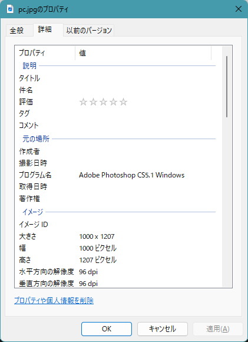
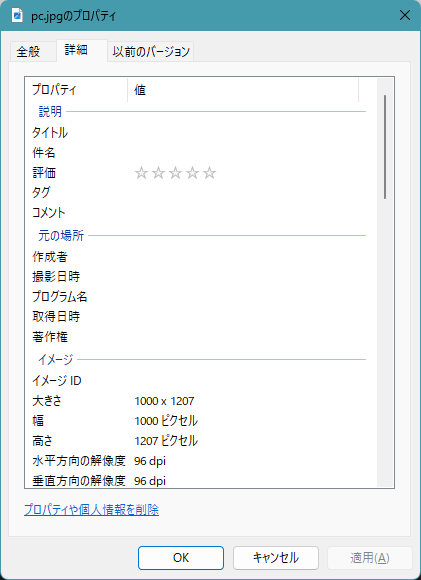

## はじめに

最近Hugoにブログを移行しましたが、ふとブログに載せた画像をDLしてみると、EXIF情報が見れることに気が付きました。
こういったEXIF情報の中には、写真の撮影日時や機種情報、位置情報が入っていたりと出して得する情報はありません。

今回は一括で消すコマンドを用意して、リポジトリに保存されている画像のEXIF情報をまとめて削除するコマンドを用意しました。

<!--more-->

## EXIF情報とは

下記のAdobeの解説ページがあったので参照してください（丸投げ）。
今回は「削除しないといけない」のスタンスで削除しますが、写真撮影テクニックの参考にする、という使い道があるのですね、なるほど勉強になります。

[EXIFファイル](https://www.adobe.com/jp/creativecloud/file-types/image/raster/exif-file.html)

## EXIF情報を消すコマンドを作る

今回、WSL(Ubuntu 22.04 LTS) で行いました。

まず、EXIF情報を削除するアプリケーションとして exiftool を使うため、インストールします。
```bash
sudo apt install libimage-exiftool-perl
```

また、並列化して動かすので parallel もインストールします。
これは、思ったよりも1件1件の exiftool コマンドの実行に時間がかかったからです。
```bash
sudo apt install parallel
```

実行用のコマンドを準備します。 tools に配置します。
```bash
#!/bin/bash

# 対象のディレクトリを指定します。
TARGET_DIR="../content/posts"

# JPGファイルを見つけ、それぞれのファイルに対してexiftoolを並列で実行します。
# -overwrite_original を使用して、_original ファイルが作成されないようにします。
find "$TARGET_DIR" -type f -iname "*.jpg" | parallel exiftool -all= -overwrite_original {}

echo "メタ情報の削除が完了しました。"
```

作成した .sh ファイルには実行権限を与えておいてください。
```bash
chmod +x delete-image.sh
```

実行用の Makefile も用意します。
```Makefile
.PHONY: meta

meta:
	@cd ./tools; ./delete-meta.sh
```

## 実行する

```bash
$ make meta
～省略～
    0 image files updated
    1 image files unchanged
    1 image files updated
Warning: ICC_Profile deleted. Image colors may be affected - ../content/posts/pc.jpg
    0 image files updated
    1 image files unchanged
    0 image files updated
    1 image files unchanged
メタ情報の削除が完了しました。
```






ICC_Profileって何だろうと思いましたが、どうやら「イメージ」→「色の表現」に記載されているところのようです。
サンプル画像だと「sRGB」が表示されていましたが、消えていました。
