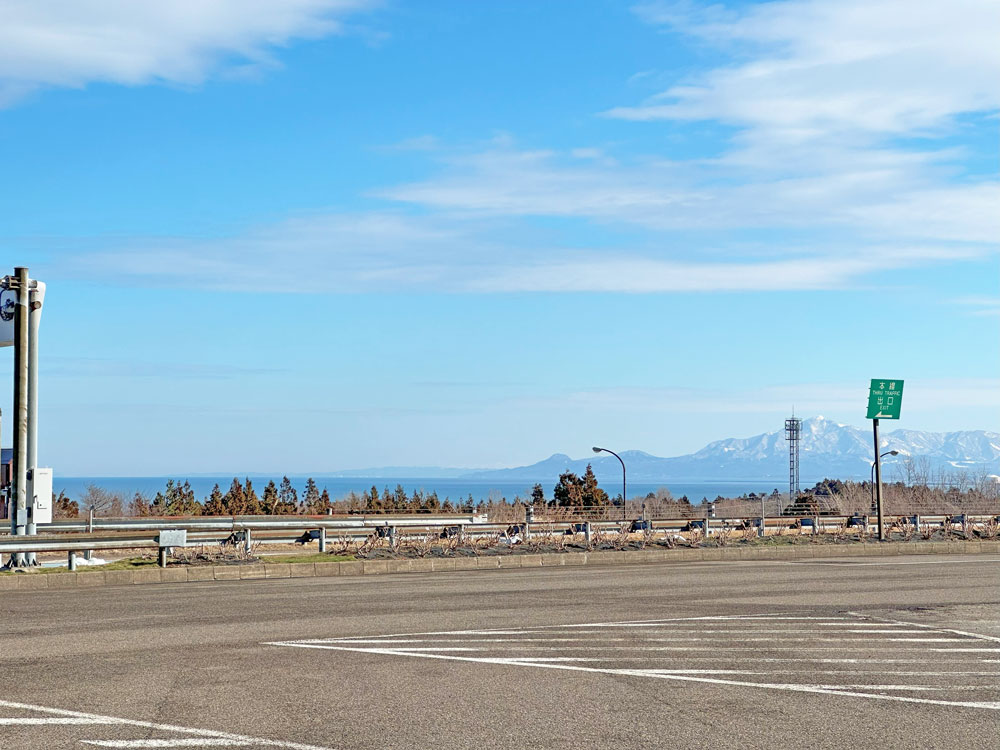
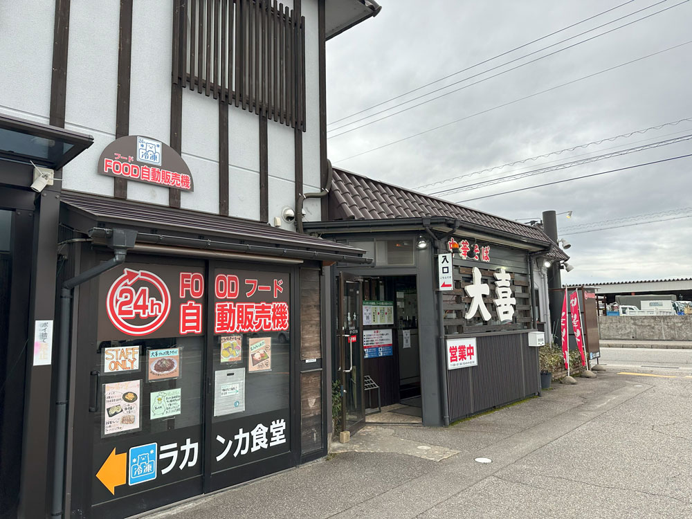
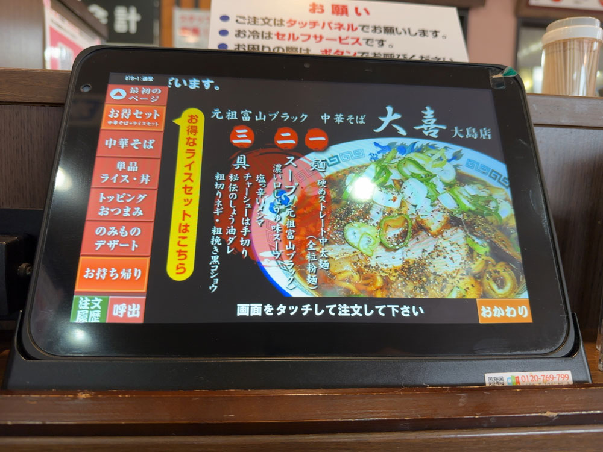
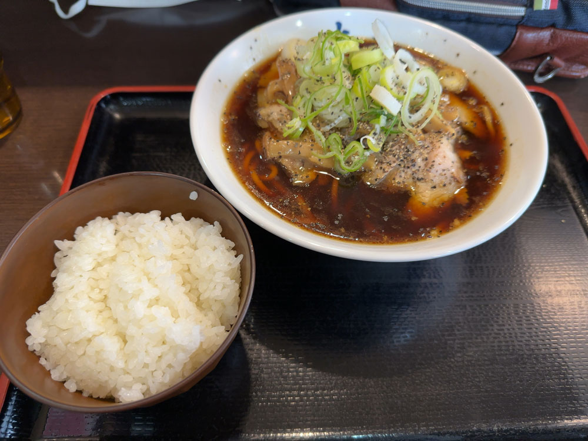
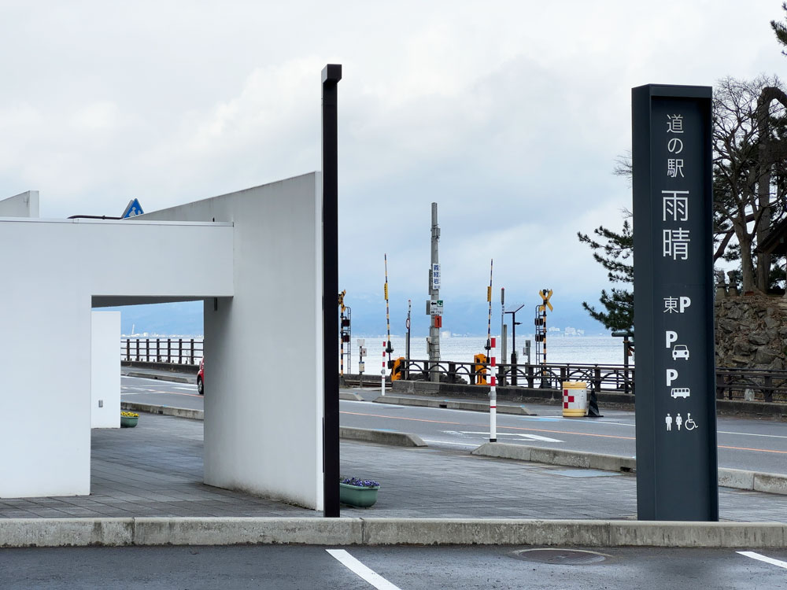
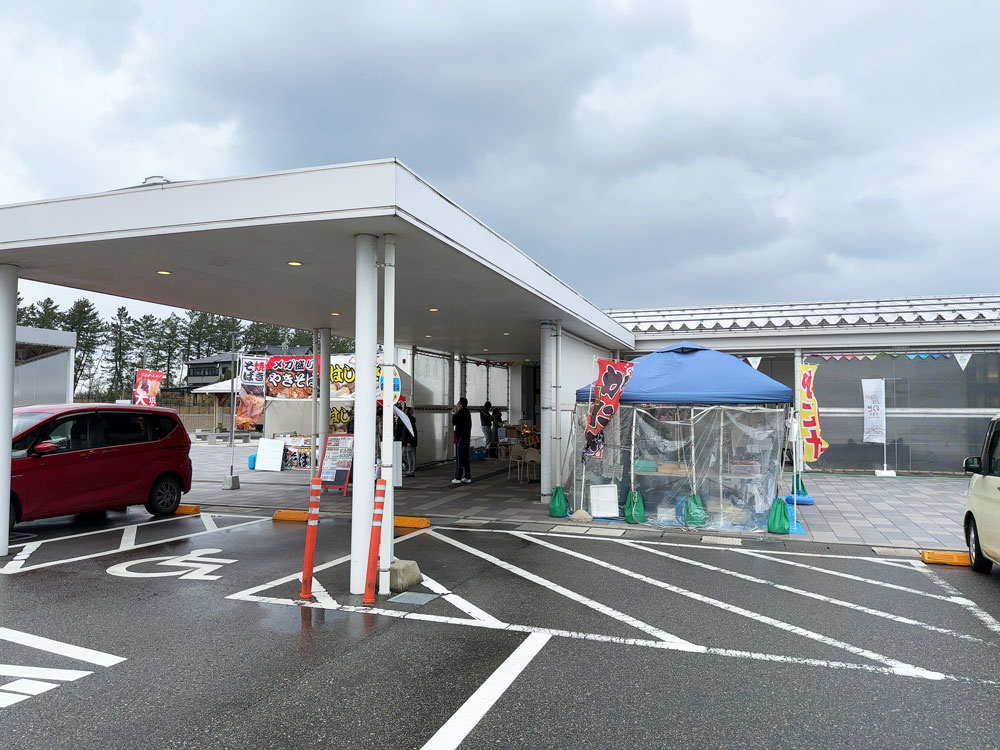
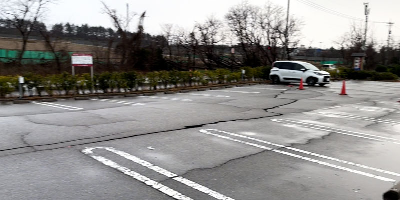
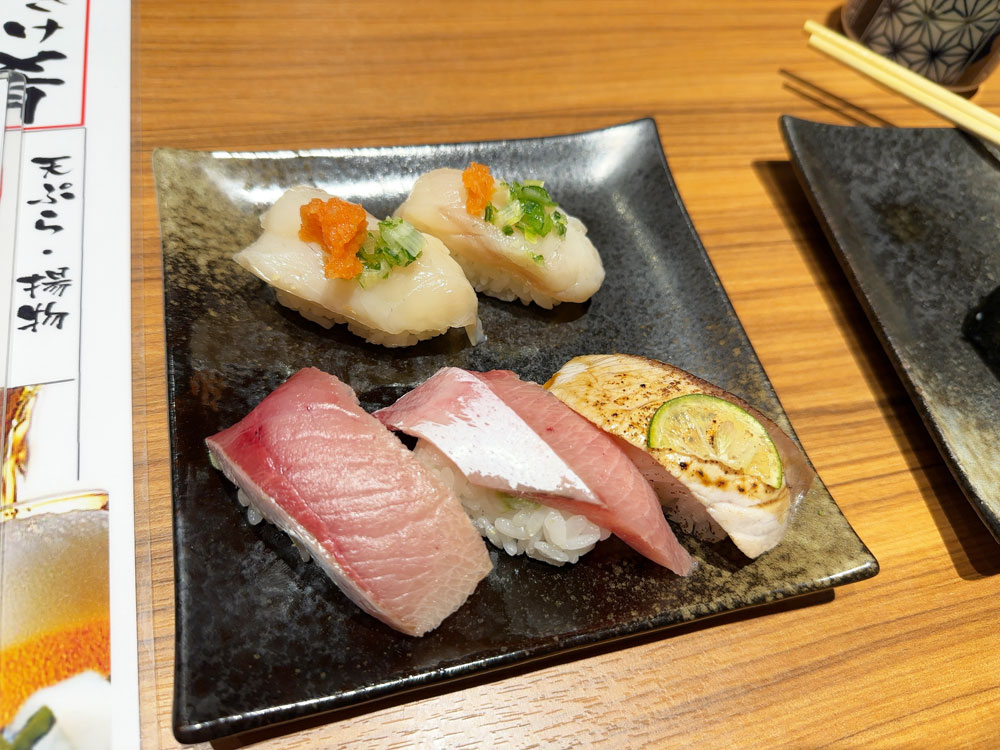

## はじめに

以前、金沢に5年半ほど住んでいました。
地震の復興支援も兼ねてお金を落としに2泊3日で北陸に弾丸旅行に行くことにしました。

箇条書きしても長くなるので、記事を日毎に分けます。
この記事は1日目です。

<!--more-->

## 出発

朝6時半に地元、栃木県小山市を出発し、東北道からの北関東道へ。

三連休初日とあって、北関東道が混んでいた。
関越道は下りが渋滞していると交通情報のラジオが言っていたので、上信越道経由を選択しました。

なお、上信越道も佐久IC近くで故障車による渋滞がありました。
浅間山や白馬は雪に覆われていてとても綺麗でした。

このあたりで、2日目にスキーをしようと板は持ってきたものの、肝心のスキーウェアを忘れたことに気づきました。
が、レンタルできるので後悔しながら進みます。

あっという間に北陸道へ。
北陸道は、何故か大量の警視庁のパトカーを見ました。（合計20台ぐらい）

## ブラックラーメン

お昼をどこで食べようか考えていて、半年ほど前に富山に訪れた際にブラックラーメンを食べそこねたことを思い出し、富山近辺で降りてブラックラーメンを食べることにしました。

流杉PAのスマートICで降りて、中華そば 大喜 大島店へ。

 
 

しょっぱいけど旨味成分が多くて、めちゃくちゃ美味しかったです。

## 雨晴海岸

夕方にかほく市の知人のところに行く予定がありまだ時間があったので、ドライブがてら雨晴に行くことにしました。
ちなみに雨晴は「あまはらし」と読むのですが、何度も行っているのに知らずにいたので恥ずかしい。
今度こそ覚えました。

天気が良いと立山連峰まで見れるのですが、この日は残念ながら見れず。

道の駅雨春では、ポストカードなど買いました。

## 氷見経由で羽咋、かほくへ

震災の影響でどこまで北を回れるかわからなかったのですが、調べてみた感じは一般車両も通れそうだったので、氷見から国道415号を経由して羽咋に抜けました。

結論問題なく抜けれましたが、ところどころ道路を補修した後がありました。

羽咋でアルビス（スーパーマーケット）に寄りました。
このあたりの物流は問題ないため、乾物をベースに色々買いました。
お店には「頑張ろう能登」と書いてあったり、店員がみんな明るかったり、部外者ですがなんだか嬉しくなりました。

道の駅のと千里浜にも寄り、お土産を買いました。

千里浜ICからと里山海道に乗り、金沢方面へ。

のと里山海道は、災害派遣系の車両が多く通行していました。
他県ナンバーの病院や、赤十字、携帯インフラ系の車両など。
まだまだ震災真っ只中ということを実感させられました。
観光で来ている自分が申し訳なくなりますが、自分にできることはお金を落として復興を支援することなので、全力で応援しようと思いました。

道の駅高松（県立看護大IC）に寄り、ここでもお土産を購入。
前職の知り合いが飲食店を経営していて、その系列のレトルトカレーが売っていたので嬉しくなって購入。

その後かほくに住んでいる知人の家へ。
気付いたら結婚し、一軒家を立て、子供ができていました。

新築だからか地震の影響は殆どなかったようです。
少し物が落ちたぐらいで、断水もしなかったようです。

幸せそうで良かった。

## お風呂、ご飯

のと里山海道の始点にある天然温泉 湯来楽 内灘店に寄りました。
内灘は液状化が激しく道が通行不可になった場所もあるようで、この温泉の駐車場も一部被害がありました。

ここの温泉は何度か来たことがありますが、広いお風呂でゆっくりできました。
ここも店員さんが明るく、復興ボランティアの方も終わった後に疲れを癒やしに来るのかなと想像していました。

夜ご飯は金沢でお寿司を食べたいと思っていたので、海天すし 港店さんへ。

どれも最高でした。

一人で好きなものを食べたつもりですが、5,000円もいかなかったです。
冬の北陸で、金沢で、最高のお寿司を食べているという事実を感じて自然と涙が。。

## 宿へ

2日目は朝からジャム勝（スキージャム勝山）に行く予定で、福井に宿を取っていたので移動。

宿の近くのドンキで晩酌を買い出ししましたが、見事にヤンキーが多くてさすが安定のドンキでした。

チェックインした後ホテルで晩酌しているとホテルから携帯に電話がかかってきて（部屋に電話はない）、車の車内のライトがついているという連絡。
他のお客さんが気づいてくれたよう。
優しい世界、本当にありがとうございます！！

2日目に続く。



