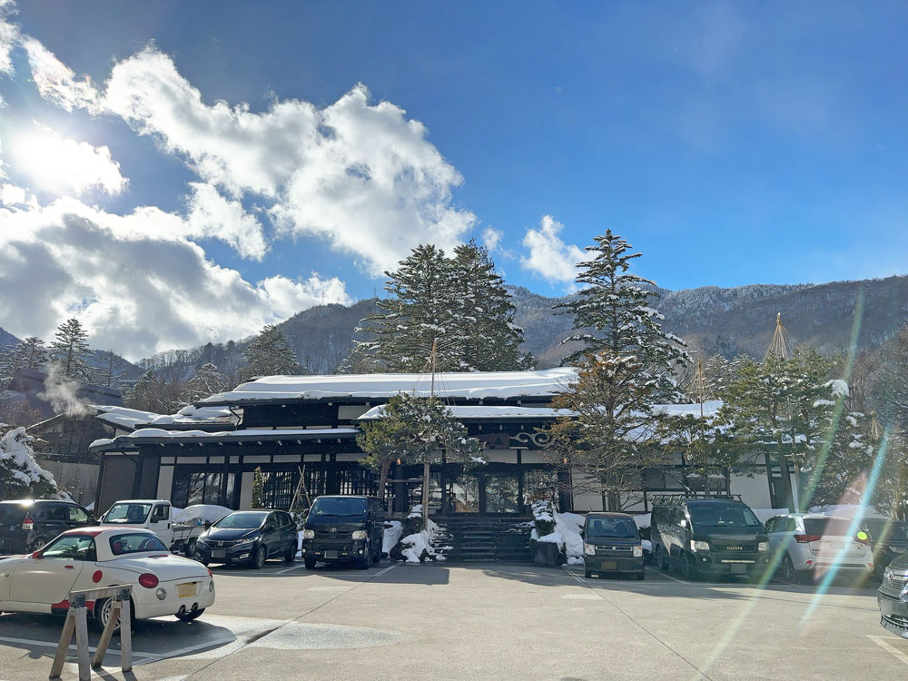
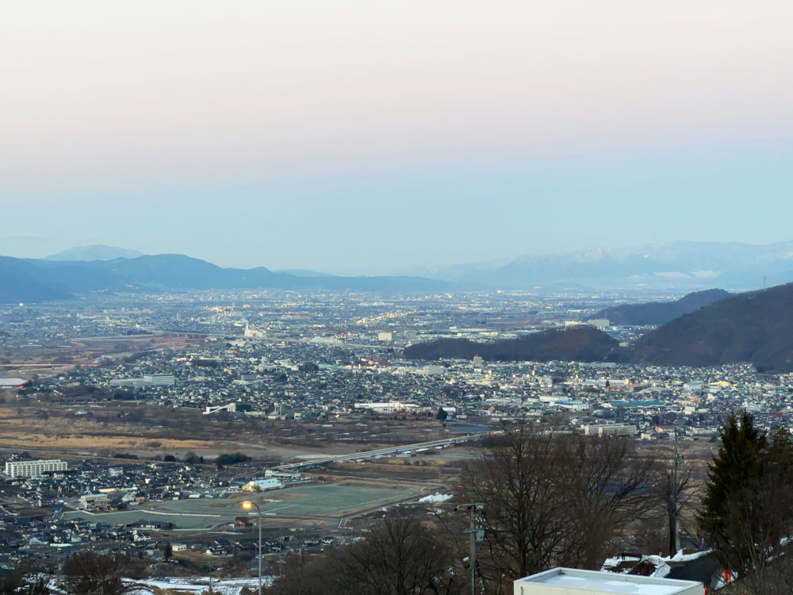
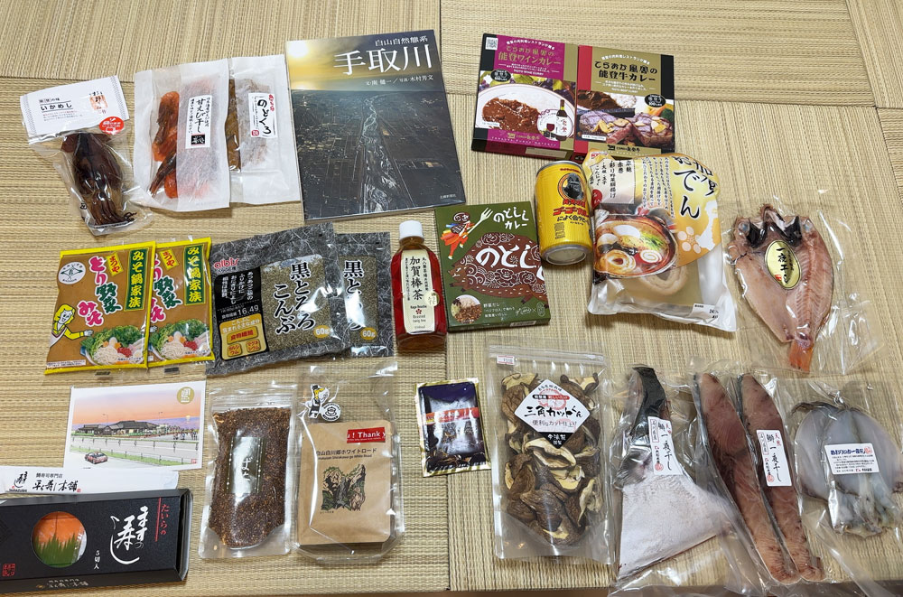

## はじめに

北陸に2泊3日で旅行に行ってきた記事の3日目です。
1日目と2日目はこちらから。

<!--more-->




## 朝ご飯、近江町市場

6時45分起き。

朝ごはんは近くの高倉町珈琲 金沢桜田店へ
携帯を車においてきて写真はないですが、パンケーキ最高でした。
特性クリームがたまりません。

https://takakuramachi-coffee.co.jp/

その後、お土産を買いに近江町市場へ。
石川県産ののどぐろの干物が欲しくて探していましたが、ほとんどが山口県産でした。
端のお店で輪島港ののどぐろの一夜干しが残っていたので、購入。

他にも、ぶりの一夜干し、ぶりかまを購入しました。

栃木には夜までかかりますが、店員に相談したら保冷剤あればこの時期なら大丈夫ということで購入しました。
結論、夜に栃木についてもまだ保冷剤はしっかり凍っていました。

近江町市場にはテレビも来ていて、おそらくこれだと思います。
（私は写っていません）
https://news.yahoo.co.jp/articles/085fadc7cf733861a70a544b97450cbafce501ce

## 砺波、帰路

金沢を後にし、砺波で知人に会うために県道27号金沢大学の横を通って砺波へ向かいました。
砺波に住んでいると思って砺波で待ち合わせをしましたが、どうやら今は富山市の方に住んでいるそう。

あとは栃木に帰るだけですが、時間もあり折角ならと思い奥飛騨温泉郷からの松本経由で帰ることにしました。
金沢にいるころから何度も通っていたひらゆの森、久々に行きましたが熱々で最高でした。
外国人観光客もいました。

安房峠を通り、松本ICからは上信越道へ。
姨捨SAが絶景の名所なので寄りました。

夕方でしたが、絶景でした。

お土産たくさん買いました、幸せでした。
また遊びに行きます。

