## モチベーション背景

私は、ブログ記事を VSCode + Markdown で書いています。
画像を記事に貼り付ける際、今までは下記の流れで行っていました。

1. 画像ファイルを選択して Ctrl + C でコピー
1. VSCode 上で貼り付けると、ファイルが貼り付けられ、マークアップも自動で入力

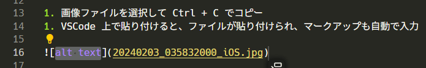

この際に、元のファイル名やメタデータも一緒にコピーされて困っていました。

これを防ぐには、別のアプリケーションを介すなどしてメタデータを削除する必要がありました。

今回、この作業の効率化のため、画像の右クリックから純粋な画像情報のみをコピーする機能を作ったので紹介です。

<!--more-->

### 環境

* Windows 11 Pro 23H2

## Visual Studio 準備

右クリックを押した際の項目に追加するには Windowsのシェル拡張機能を開発する必要があります。
これは Visual Studio で開発するのが良さそうです。

今回は Visual Studio Community 2022 を使用します。

https://visualstudio.microsoft.com/ja/vs/community/

ワークロードは「.NET デスクトップ開発」にチェックを入れてインストールします。

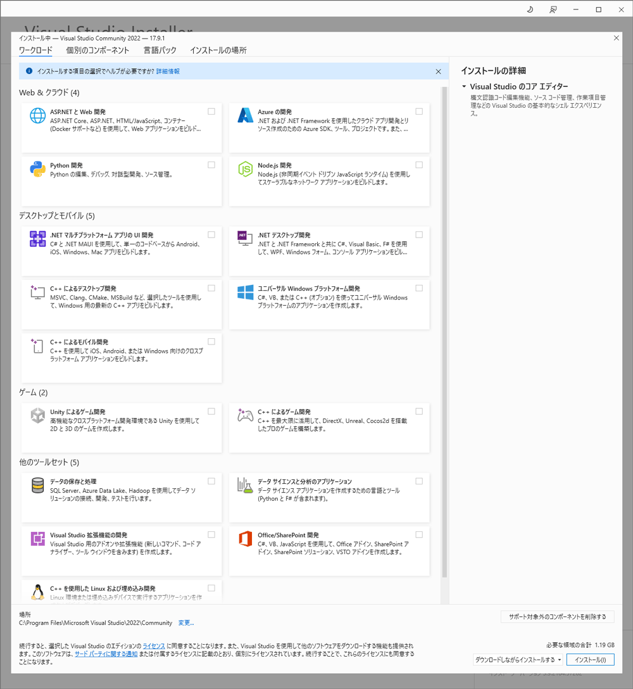

インストールしたら、プロジェクトを作成しておきます。
今回、プロジェクト名は「NabaImageCopy」にしました。


## 必要なパッケージのインストール

NuGetで、以下の4つのパッケージをインストールします。
私は .Net 初心者のため、非常に浅い理解での説明です。
間違って紹介している可能性もあるため、詳しくはリンク先を見てください。

* [SharpShell](https://github.com/dwmkerr/sharpshell)
    * .Net を使用して C# でシェル拡張機能を簡単に作れるパッケージです
* [Magick.Net.Core](https://github.com/dlemstra/Magick.NET)
    * .Net 環境上で ImageMagick の機能を使えるようにしたパッケージです
    * 下記の2つのパッケージもこれに依存しています
* Magick.Net-Q16-AnyCPU
    * Magick.Net での画像変換の精度です。Q16だと画像は16bitで扱われます
    * [Q8, Q16 or Q16-HDRI?](https://github.com/dlemstra/Magick.NET/blob/main/docs/Readme.md#q8-q16-or-q16-hdri)
* Magick.Net.SystemDrawing
    * Magick で System Drawing を使用するためのパッケージです

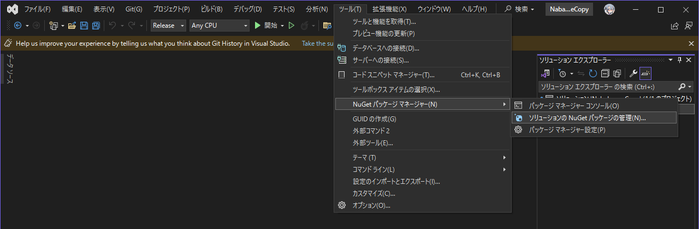

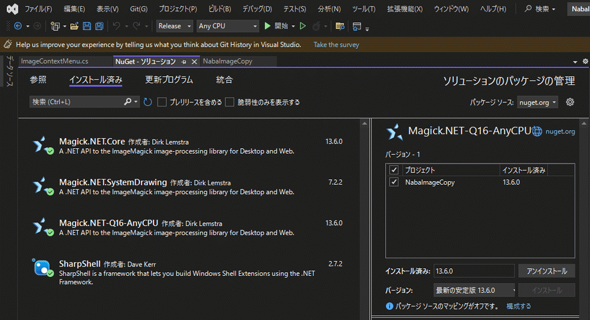


## コーディング

コーディングは ChatGPT と行い、最終的に以下のコードになりました。

```C#
using System;
using System.Linq;
using System.Runtime.InteropServices;
using System.Windows.Forms;
using ImageMagick;
using SharpShell.Attributes;
using SharpShell.SharpContextMenu;

namespace NabaImageCopy
{
    [ComVisible(true)]
    [COMServerAssociation(AssociationType.AllFiles)]
    public class ImageContextMenu : SharpContextMenu
    {
        // メニューを表示するかどうかの条件
        protected override bool CanShowMenu()
        {
            // 今回は、指定された拡張子であることを条件にします
            return SelectedItemPaths.Any(item => item.EndsWith(".jpg", StringComparison.OrdinalIgnoreCase)
                                             || item.EndsWith(".jpeg", StringComparison.OrdinalIgnoreCase)
                                             || item.EndsWith(".heic", StringComparison.OrdinalIgnoreCase)
                                             || item.EndsWith(".png", StringComparison.OrdinalIgnoreCase)
                                             || item.EndsWith(".bmp", StringComparison.OrdinalIgnoreCase)
                                             );
        }

        // メニュー内容の指定
        protected override ContextMenuStrip CreateMenu()
        {
            var menu = new ContextMenuStrip();

            var itemCopyImage = new ToolStripMenuItem
            {
                Text = "画像をコピー",
            };
            itemCopyImage.Click += (sender, args) => CopyImageToClipboard();

            menu.Items.Add(itemCopyImage);

            return menu;
        }

        // 画像をコピーする実装
        private void CopyImageToClipboard()
        {
            var imagePath = SelectedItemPaths.FirstOrDefault();
            if (string.IsNullOrEmpty(imagePath))
                return;

            try
            {
                using (var image = new MagickImage(imagePath))
                {
                    using (var bitmap = image.ToBitmap())
                    {
                        // クリップボードに画像を設定します。
                        Clipboard.SetImage(bitmap);
                    }
                }
            }
            catch (Exception ex)
            {
                MessageBox.Show("画像をクリップボードにコピーする際にエラーが発生しました。" + ex.Message);
            }
        }

    }
}
```

## プロジェクトの設定

プロジェクト -> プロジェクトのプロパティをいくつか設定します。

まずは、アプリケーション -> アセンブリ情報から「アセンブリを COM 参照可能にする」にチェック。
COMとは -> https://learn.microsoft.com/ja-jp/windows/win32/com/component-object-model--com--portal

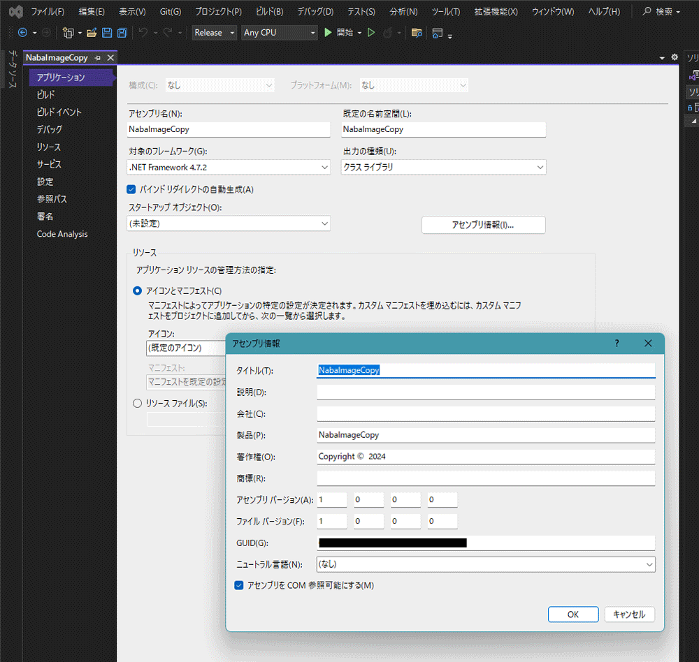

続いて、アプリケーションに署名します。
署名 -> 「アセンブリに署名する」にチェック。
新規作成で鍵を作り、署名します。

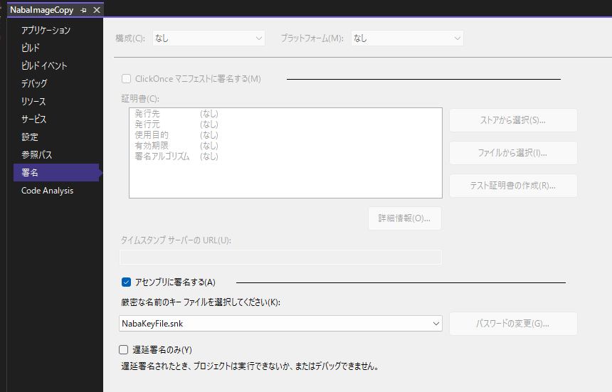

## コンパイル

Windows のアプリケーション拡張（.dll）を作成している関係でそのままでは実行できません。
デバッグの方法もあるようですが、簡単なシェルなのでいきなりリリースビルドをして、実際にインストールして確かめてみます。

リリースビルドをするには、構成を Release に変更します。

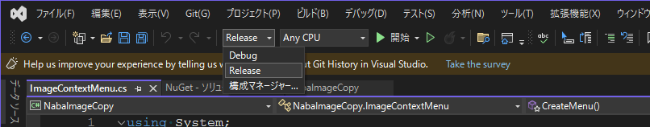

その後、ソリューションのビルドをするだけです。簡単ですね。

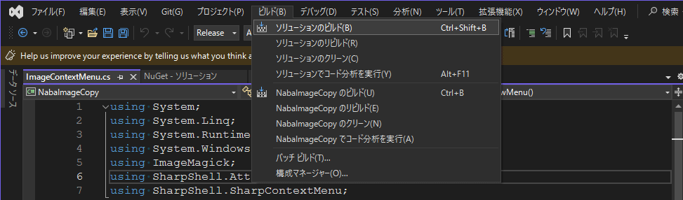

ビルドが正常に完了すると、必要なパッケージと共に、プロジェクト配下の bin/Release に色々配置されます。

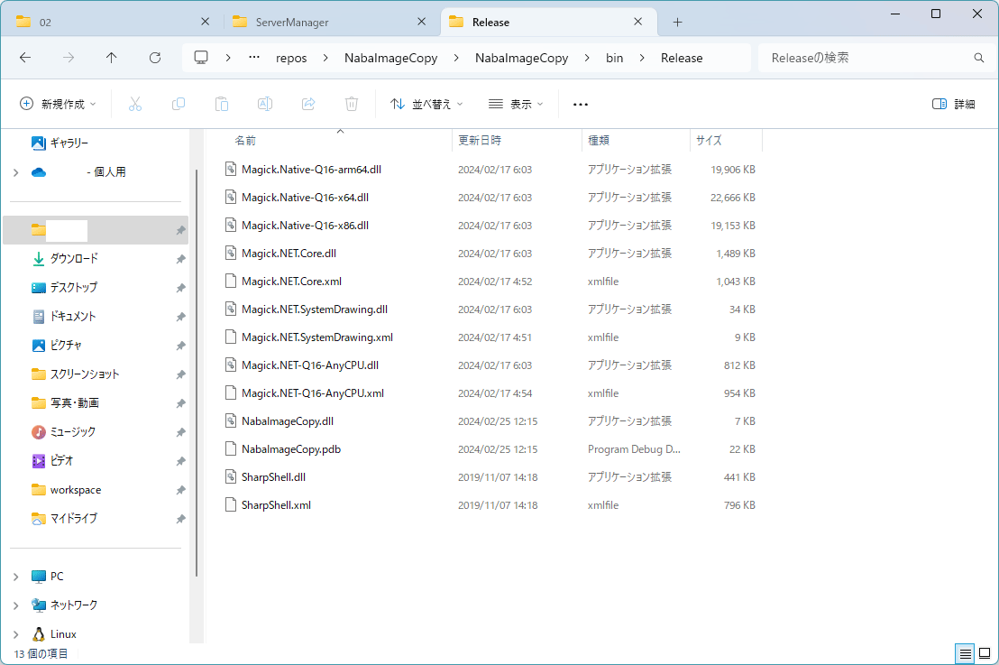

今回は、これを `C:\MyDLL\NabaImageCopy` に配置しておきます。

## インストール

Windows拡張機能のインストールは、SharpShell 付属の ServerManager を使用して行うことにします。

https://github.com/dwmkerr/sharpshell/releases

ServerManager.zip をダウンロードして展開します。

管理者として実行すると、下記画面が開きます。

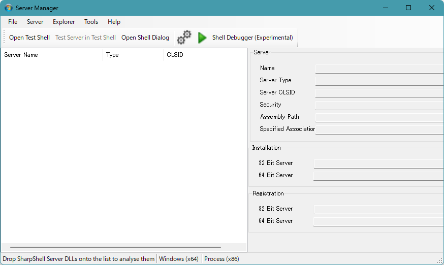

File -> Load Server から NabaImageCopy.dll を選択します。

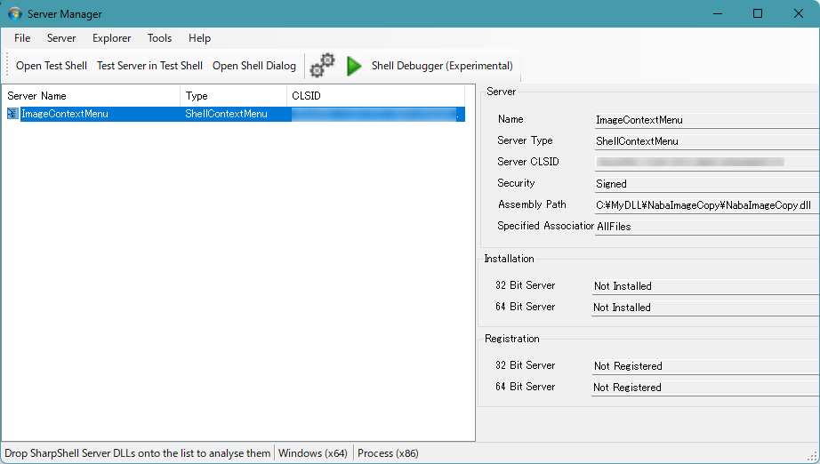

Server -> Install でインストールします。

インストールされたら、エクスプローラーを再起動します。

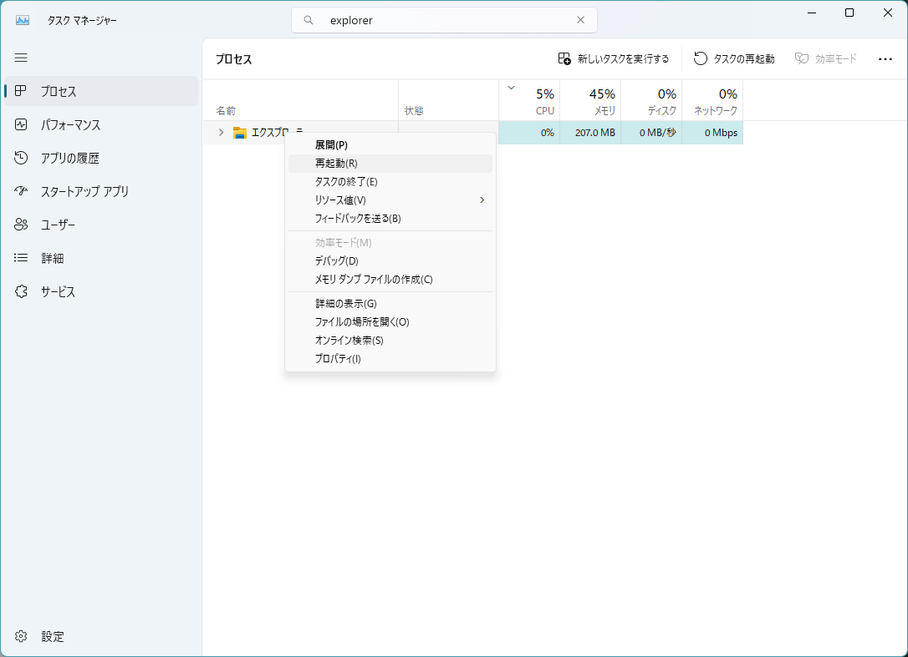

## 動作確認

適当な画像を選択し、「その他のオプションを確認」を押すと、メニューが追加されていました。

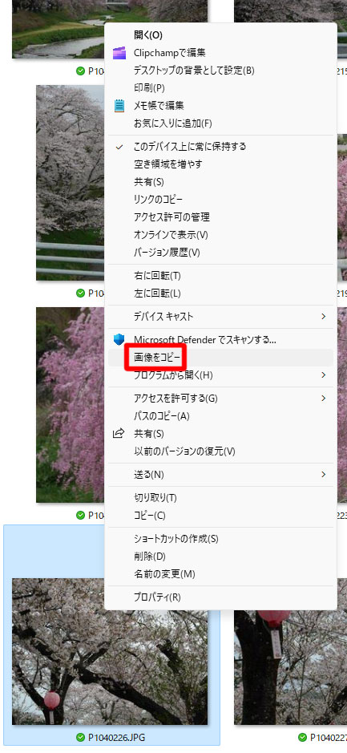

そして、それを押して VSCode 上で貼り付けてみると、無事にメタデータ無しで貼り付けることができました。

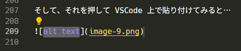

## おわりに

Windows シェル拡張機能を初めて作りました、思ったよりも簡単に作ることができました。
ちゃんと学べば、業務の効率化も簡単にできそうです。

コーディングは ChatGPT にかなり助けられました。
ただ、プロジェクトの設定は ChatGPT だけでは中々解決できず、Google 検索する必要があったので、広い視点で聞く必要があったのかなと思います。
