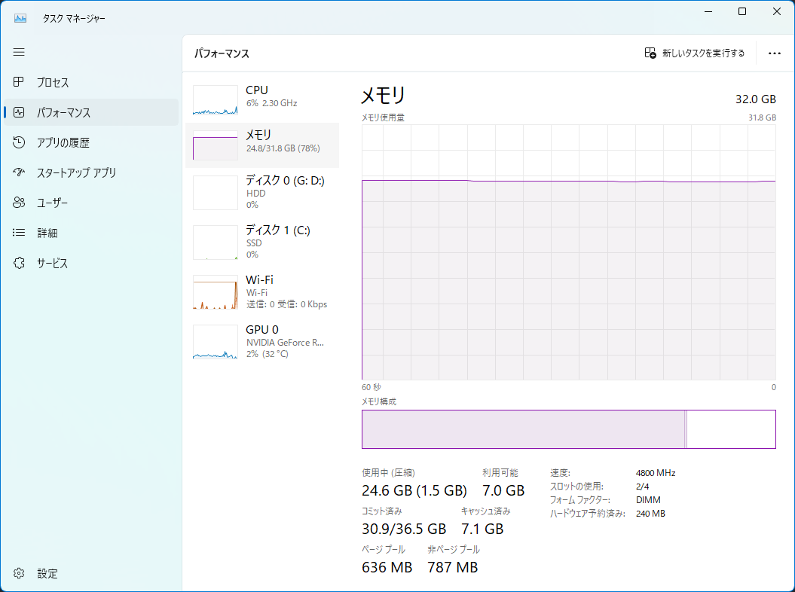
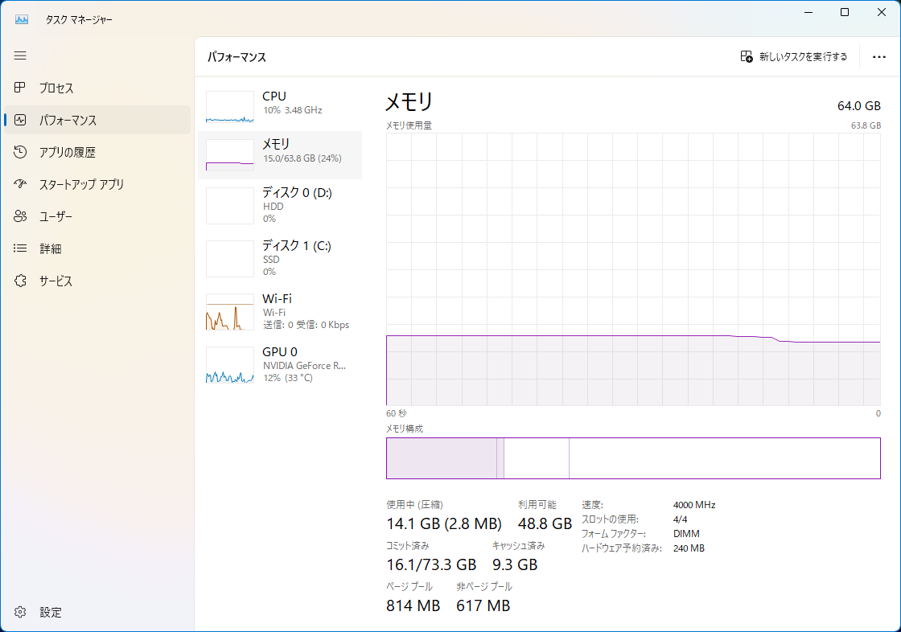

## はじめに

今年の1月に新しく自作PCを組みました。


最近メイン開発をこのWindows機で行っているのですが、WSL等仮想環境を立ち上げていると、なんだかんだ32GBでは心もとなくなってきました。

なので32GB足して、64GBにしました。

<!--more-->

## 買ったメモリ

組んだときと全く同じものです。

CMH32GX5M2B5200C40W [DDR5 PC5-41600 16GB 2枚組]
https://kakaku.com/item/K0001461122/

メモリを増設するときは、同じ容量、速度、できればメーカーも揃えたほうが良いとよく言われていますね。

## before / after

メモリの多さは心の余裕ですね（？）。

## 動作クロックが低下している件

増設する前は4800MHzでしたが、増設後は4000MHzになりました。
これはBIOS側で自動調整にしているからですね。

調べたところ、一般的に物理メモリの数を増やすと、動作周波数は減ることが多いようです。

一応オーバークロックで周波数を上げることはできますが、安定するか不明だったので上げないでおきます。

## おわりに

ちなみに、ゲームなどを入れていると今度はSSDの容量が足りなくなってきました…。

近々、M.2 SSDも増設したいと思います。