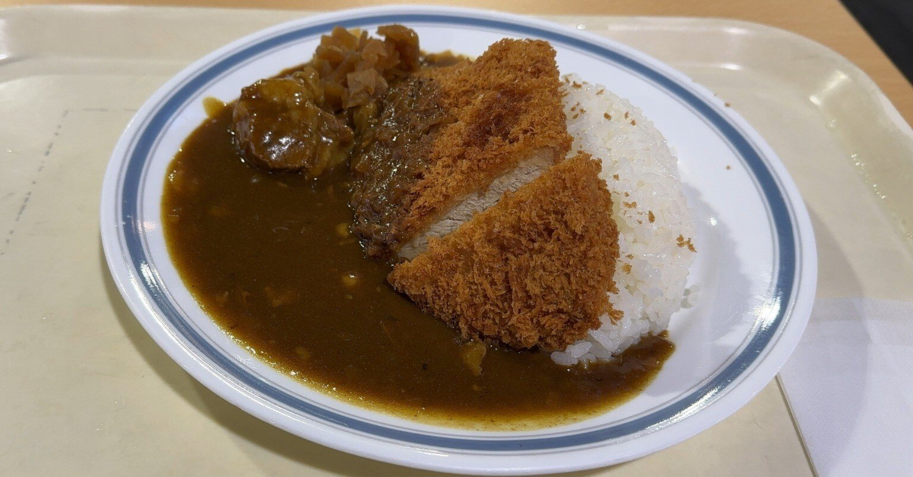

私は意固地な性格だと思っている。
つまらないことに固執したり、見栄を張ったり、我慢したりする。

裏を返せば、他人に気を使いすぎなのかもしれない。
そのまた裏を返せば、自意識過剰なだけかもしれない。

仕事でもプライベートでも、自分をよく見せようとしてしまう。
たまに進捗を軽く誤魔化してしまうし、咄嗟に嘘をついてしまい、後悔することもある。
なんでだろう。
何かの防衛反応なのかな。
もしくは、他人に幻滅されたくない、とか。

ということで、頑張って素直な感情を書く練習をしてみる。

私はスキーが好きだ。
たまに一人でも行くし、今日はまさにその日だった。

初めて行くスキー場で、勝手が分からない。
案内に従って、事前購入したチケットをICカードに交換する。
チケットの機械が私のスマホのQRコードをなかなか読み込んでくれなくて、四苦八苦した。
よくあることだけど、自分が当事者になると焦る。

朝早くに出たので、混まないうちにレストランでお昼を食べる。
席は空いていたので、カツカレーを4人席に置く。
食べ始めてから、カツのために箸が必要だということに気付いて、取りに行く。
もう少し食べて、水がないことに気付いて給水所へ向かう。
誰かと来ていたら、あれこれ話しながら食事の準備をしていたから、食べ始める前に気付けたと思う。
けど、一人だったし、少なからず周りに人もいたので、「勝手は分かってますよ」感を出したかったから周りをよく見ていなかったのかもしれない。
初めからキョロキョロしておけばよかったものを、惨めだ。

家族連れや友達グループに紛れ込みながら、リフトの列に並ぶ。
しばらく待って、ようやく順番が回ってきたときに、相乗り用の「お一人様待機列」があることに気付く。
周りの人は、「この人、一人なのになんで向こうの待機列に行かないんだろう」と思ったのだろうか。

悪いことは何もしていないはずなのに、終始ばつが悪かった。
一人が故の問題？それともそもそもの性格？
