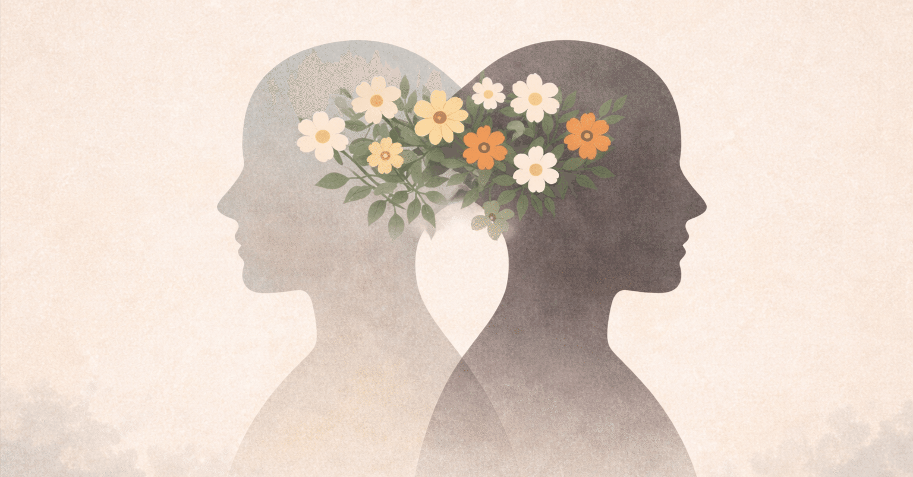

ペアの数だけ価値観が違うということは前提に、あえて理想のパートナーとの関係とは何かを考えてみる。

まず第一に、相手を変えることを求めない。

その人にはその人の価値観がある。生まれ育った環境も違えば、食事の好みが完全に同じ人などいない。
価値観に対してアドバイスをすることはできるけれど、それを義務付けることはできない。
だから、命に関わるような場面や切羽詰まった状況でもない限り、相手に何かを強要することはできない。

実際には、人生経験の中で価値観は変わっていく。
ただ、それはあくまで結果であって、相手が変わることを前提に関係を築いてしまうと、理想と現実のギャップに苦しむことになる。

ある程度の気持ちの依存は、人間同士である以上、認めざるを得ない。
会いたいと思うこともあるし、それをお互いに心地よく感じられるのであれば、特に問題はない。

問題になるのは、相手が「自分の価値観に従ってほしい」と思い始めたときだ。
片方は従わせることで絶対的な所有感を感じ、もう片方は従うことで所属感を感じる。
ただしそれは、行き過ぎた共依存の関係であり、自分の機嫌を他者に委ねてしまった、歪んだ愛の形だと思う。

一時的に強く惹かれている間は関係が続くかもしれない。
しかし、どちらかが求めすぎてしまったり、過度に相手の言うことを聞きすぎてしまうと、関係の中に力関係が生まれる。

それが続き、なおかつ話し合いによって修復できなければ、いずれどちらかが苦しくなり、関係は終わりを迎えることが多い。

それを防ぐためには、相手から与えられる無償の愛は存在しない、という前提を受け入れる必要がある。

もともと他人であったからこそ、相手を尊敬し、認めたうえで、自分が相手にしてあげたいと思うことをし続ける努力が必要になる。それは、一定程度必要であり、大切なことだと思う。

努力の形は、他人から求められる努力に依存するのではなく、自分から相手に与える努力が大半を占めている状態が望ましい。

言い換えると、相手に求めることよりも、自分から相手に与える行動のほうが多い関係でありたい。

その前提があれば、多少相手から何かを求められても、「この人になら応えたい」と自然に思えるし、気持ちのよい、健全な依存関係になれる。

ただし、やり過ぎてしまうと、自己犠牲になったり、「これだけ頑張っているのに、なぜ対価が返ってこないのか」と相手に求めてしまう発想にもなりかねない。
だからこそ、バランスが必要になる。

完璧な人はいないし、誰しも何かしらの苦手を抱えている。
相手の苦手な部分も含めて受け止めようとする努力も、関係には必要だと思う。

お互いが少しずつ努力を重ねていくことで、価値観の歯車は徐々に噛み合っていく。

そのためにも、心の安定と関係の構築とのバランスを取ることが大切。
相手に与えすぎていないか、受け取りすぎていないか、自分の心が苦しくなっていないかを、定期的に振り返る必要がある。

関係を運用していく中で、相手の知らなかった一面を発見し、驚き、モヤモヤすることもある。

そのモヤモヤを自分の中で健全に消化できるのであれば、それ自体は問題ではない。
ただし、どうしても相手に直してほしいことがあるのであれば、素直に伝える。

言う側だけでなく、言われる側にも心構えが必要だ。
そのためにも、「関係を長続きさせるには、健全な話し合いが必要だ」という認識を、あらかじめお互いに共有しておくことが大切だと思う。

話し合いの場では、自分の意見を無理に通そうとしないし、相手を否定もしない。
相手を尊重したうえで、自分がどこを変えられるのかを、互いに探っていく。
行動そのものを変えることもあれば、頻度を調整することもあるし、条件をつけることで折り合いがつく場合もある。
相手に提案することはできるけれど、それを必ず受け入れてもらえると期待しすぎないことも大切。

折り合いがつけば、二人だけの新しい価値観が生まれる。
その積み重ねによって、結果的に心理的安全性の範囲が広がっていく。

関係構築の最終的な目的は、「この人と生きていきたい」と思えること。

この人の人生の半分に責任を持ち、自分の人生の半分を相手に委ねる。
人生をこの人と添い遂げたい、一緒にいることが幸せだと、自分の意思で思えること。
それは、相手から何かを与えてもらうことで満たされるものではなく、自分自身が能動的に選び続ける感情だと思う。

関係を続けていく中で、いずれ「この人となら人生を一緒に過ごしたい」と思うときが来る。
そのときが、結婚なのだと思う。

理想の関係にゴールはない。
だからこそ、どこかで期日を決めて「えいや」と踏み出す決断も必要になる。
その背中を押してくれるのが、これまでに積み重ねてきた心理的安全性なのだと思う。

完璧な理想の関係を築けているペアは、多くないとは思う。

人間なのだから、こんな理想を常に実践するのは難しい。
話し合いの場でうまく言葉にできなかったり、言えなかったりすることもある。

それでも、「こういう関係が理想だよね」という方向性をお互いが理解していれば、関係は少なからず長続きできるのではないか、と思う。
